# 宿題ポスト 使い方マニュアル

## このマニュアルについて（読む前の準備）

「宿題ポスト」を初めて開いた先生が、このページだけで最後まで使えるようにまとめたものです。児童が毎朝する操作と、先生が使う11のタブを、画面写真つきで順に説明します。

### 「宿題ポスト」とは？

宿題の提出確認と、朝の健康観察（きもちメーター）を、教室に置いた1台の端末で終わらせるためのWebアプリです。

児童は、出席番号を打って、今日出したものを選び、いまの「きもち」を選びます。おおむね10秒で終わります。先生は、その記録を一覧で見たり、あとから直したり、学期末に紙で印刷したりできます。

そのほかに、忘れ物の記録、気になる児童への支援の記録、家庭とのやり取りの記録、学級全体の変化の確認もできます。どれも先生だけが使う画面で、児童からは見えません。

### マニュアルを読む前の準備

読みはじめる前に、次のものをお手元にご用意ください。

- 受付に使う端末を1台（Chromebook、iPad、Windowsのどれでも構いません）
- アプリのアドレス（https://homework-barcordreader.giga-school.com/）
- 先生用メニューのPINコード（初期値は admin です）
- 学級の名簿（氏名の一覧。あとから貼り付けて登録します）

アカウントの登録は要りません。インターネットにつながる端末で、上のアドレスを開けばすぐに使えます。

記録は、その端末の中だけに残ります。学校のサーバーにも、作った側にも送られません。

このため、別の端末で同じ記録を見ることは、そのままではできません。職員室のパソコンでも同じ記録を見たいときは、Googleドライブ同期を設定してください。設定のしかたは「記録を守る、別の端末でも同じ記録を見る（設定）」の章にあります。

端末が壊れると記録も一緒に消えます。学期に一度はバックアップのファイルをお手元に保存しておくことをおすすめします。

## アプリを開いて、ホーム画面に入れる（初回のみ）

受付に使う端末で、いちばん最初に一度だけ行う作業です。2回目からは、置いたアイコンを押すだけで開きます。

### 受付に使う端末でアプリを開く

ブラウザ（Chrome、Safari、Edge など）を開き、次のアドレスを入力してください。

https://homework-barcordreader.giga-school.com/

テンキーの並んだ受付画面が出れば、それで開けています。初めて開いたときは、見本として「さとう 花子」「すずき 太郎」の2名と、「音読」「自主学習」の2つの課題が入っています。あとで消しますので、そのままで構いません。

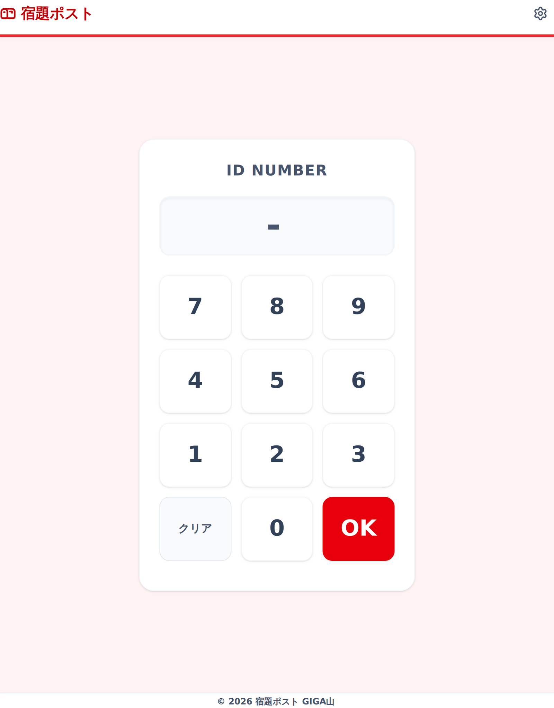

児童が毎朝見るのは、この画面です。

### ホーム画面に入れて、アイコンから開けるようにする

毎朝ブラウザからアドレスを打つのは手間がかかり、アドレスバーの分だけ画面も狭くなります。ホーム画面に入れておくと、アイコンから一度で開けて、画面も全部使えます。

Chromebook・Windows・Android をお使いの場合は、画面のいちばん上、アプリの名前の右にある「ホームに いれる」を押してください。

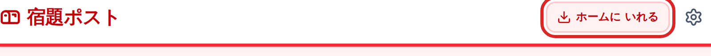

赤い枠で囲んだところが、押すボタンです。

iPad や iPhone の Safari では、このボタンは出ません。画面下（または右上）の共有ボタンを押し、「ホーム画面に追加」を選んでください。

【！】覚えておいていただきたいこと

- 「ホームに いれる」が出ないときは、すでにホーム画面に入っているか、そのブラウザが案内に対応していません。押しても何も起きないボタンを置かないよう、出せるときだけ出す作りにしてあります
- ホーム画面に入れても、記録の置き場は変わりません。同じ端末の中に残ります
- 入れ直しても記録は消えません

## 先生用メニューを開く（PIN）と、画面の地図

先生だけが使う画面は、受付画面からPINコードで入ります。ここでは、入り方と、中に何があるかを説明します。

### 歯車を押してPINコードを入れる

1. 受付画面の右上にある、丸い歯車のボタンを押してください。PINコードを聞く小さな画面が出ます。
2. PINコードを入力してください。まだ変えていなければ「admin」です。
3. 「認証する」を押してください。先生用メニューが開きます。

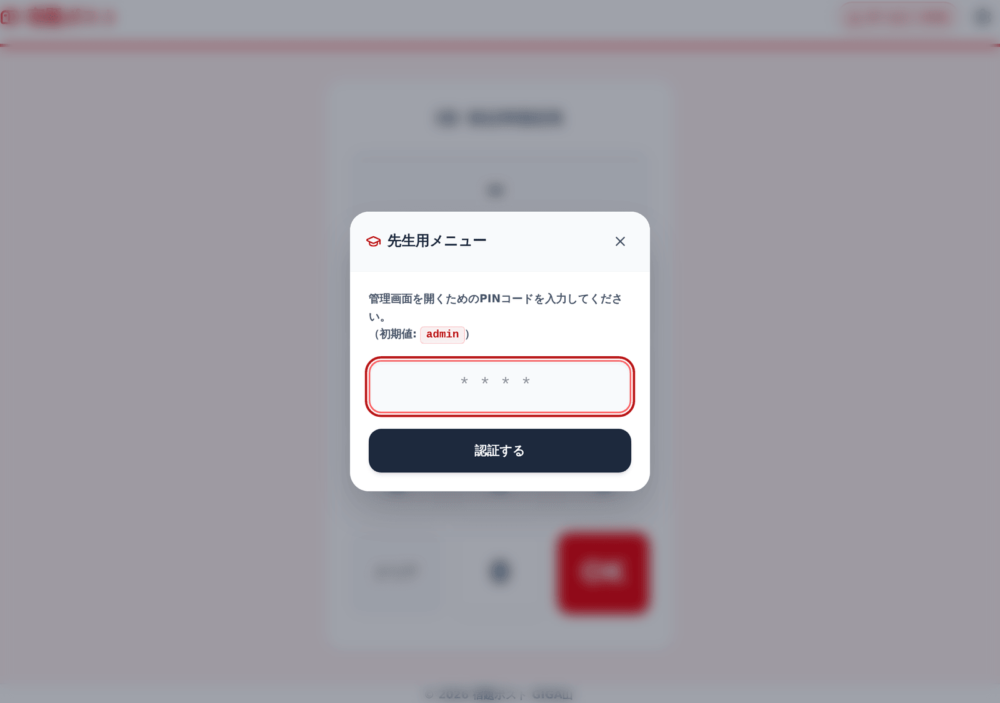

入力欄は半角の英数字だけを受けつけます。

【！】覚えておいていただきたいこと

- PINコードが違うと「PINコードが違います」と出ます。もう一度入れ直してください
- 入るのをやめるときは、右上の閉じるボタンか、キーボードの Esc キーを押してください
- 児童が操作している最中でも、歯車はいつでも押せます

### 【重要】最初にPINコードを変える

初期値の admin のままにしておくと、児童が先生用メニューに入り、名簿や記録を触れてしまいます。使いはじめる日に必ず変えてください。

PINコードを変える手順

1. 先生用メニューの「設定」タブを開いてください。
2. いちばん上の「セキュリティ設定」にある入力欄に、新しいPINコードを入力してください。
3. 「設定を保存」を押してください。

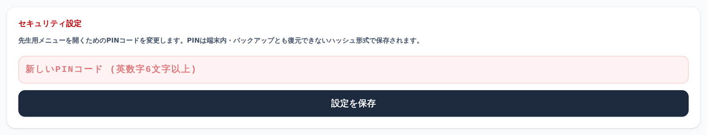

新しいPINコードは半角の英数字で6文字以上です。

【！】覚えておいていただきたいこと

- 記号やひらがなは入力できません。6文字に満たないと「PINは英数字6文字以上で設定してください」と出て、保存されません
- 保存したPINコードは、元に戻せない形（ハッシュ）で端末の中に保存されます。バックアップのファイルにも、そのままの文字では残りません
- そのため、忘れたPINコードを調べる方法はありません。控えを職員室で保管してください

### 11のタブに何があるか

先生用メニューの上には、タブが11個並びます。画面の幅が足りないときは、タブの帯を横に動かすと残りが出ます。

上が見出し、その下がタブの帯です。

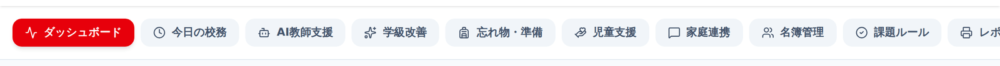

タブの帯だけを取り出したものです。

タブの役割は、左から順に次のとおりです。

- ダッシュボード … その日の提出・きもち・出欠の一覧。あとから記録を直すのもここです
- 今日の校務 … その日にやることが優先順に並びます。朝の会のあとはここだけ見れば足ります
- AI教師支援 … 下書きを作る機能です。設定しなければ何も送信されません
- 学級改善 … 学級全体の変化と、今週試せる改善候補
- 忘れ物・準備 … 授業中の忘れ物を、その場で1件ずつ記録します
- 児童支援 … 気になる児童について、事実と支援と目標を分けて記録します
- 家庭連携 … 電話・面談・連絡帳などのやり取りを記録します
- 名簿管理 … 児童の登録と修正
- 課題ルール … 何を、いつ出すかを決めます
- レポート印刷 … 3種類の資料を印刷します
- 設定 … PINコード、バックアップ、同期、年度更新

先生用メニューを開いたまま10分間なにも操作しないと、安全のため自動で受付画面に戻ります。戻ったときは「安全のため、操作がなかった先生用画面をロックしました」と画面の下に出ます。

朝の受付の前に先生用メニューを開いたままにしておいても、児童が来るころには受付画面に戻っています。もう一度開くときは、歯車からPINコードを入れ直してください。

## 名簿に児童を登録する・あとから直す（名簿管理）

出席番号は、児童がテンキーで打つ番号になります。学級の出席番号とそろえておくと、児童が迷いません。

### 名簿の画面を開く

先生用メニューの「名簿管理」タブを押してください。上に2つの入力欄、下に「現在の名簿」が並びます。

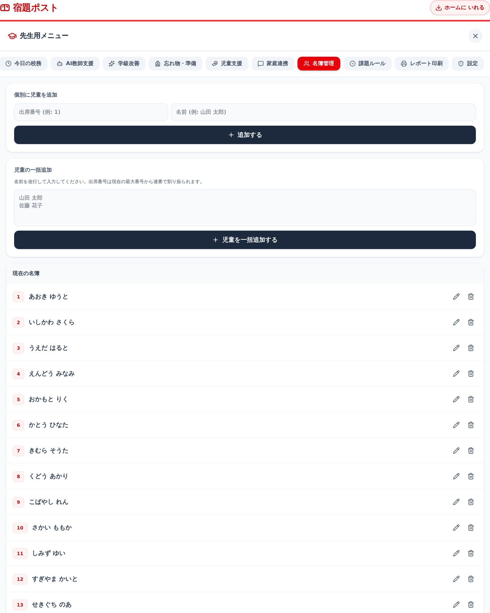

上が個別の追加、その下が一括追加、いちばん下が現在の名簿です。

### 名前を貼り付けてまとめて登録する

学級の名簿をそのまま貼り付けて、一度に登録できます。

1. 「児童の一括追加」の広い入力欄に、児童の名前を1行に1名ずつ貼り付けてください。
2. 「児童を一括追加する」を押してください。

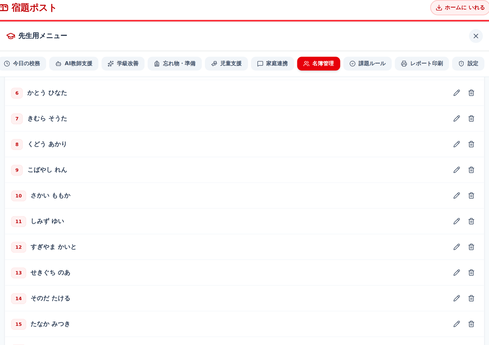

名前を改行で区切って入れてください。

出席番号は、空いている番号のうち小さいほうから順に、自動で割り当てられます。1番から28番まで空いていれば、貼り付けた順に1番から並びます。

【！】覚えておいていただきたいこと

- 追加したあとで番号を入れ替えたいときは、下の「現在の名簿」から1名ずつ直せます
- 空白の行は飛ばされます。名簿の途中に空行があっても構いません
- 同じ名前を2回貼り付けると、2名として登録されます。重ねて押していないか確かめてください

### 出席番号を自分で決めて1名ずつ追加する

転入生など、番号を決めて1名だけ足したいときは、上の「個別に児童を追加」を使ってください。

1. 左の欄に出席番号を入力してください。
2. 右の欄に名前を入力してください。
3. 「追加する」を押してください。

すでに使われている番号は登録できません。空いている番号を指定してください。

### 見本の2名を消す、出席番号や名前をあとから直す

初めて開いたときに入っている「さとう 花子」「すずき 太郎」は見本です。学級の名簿を登録したら、この2名は削除してください。残しておくと、提出率の母数に数えられます。

現在の名簿の右にあるごみ箱のボタンを押すと削除できます。誤操作を防ぐため、PINコードの入力を求められます。

現在の名簿の右にある鉛筆のボタンを押すと、その児童の出席番号と名前を直せます。

直すと、それまでの提出の記録、朝のきもちの記録、忘れ物の記録、児童支援の記録も、同じ児童のものとして一緒に付け替わります。過去の記録が行方不明になることはありません。

## 課題ルールを決める（課題ルール）

何を、いつ出すかを決める画面です。ここで決めた課題が、児童の「今日だすもの」に並びます。

提出の記録は課題名で結びつくため、同じ名前の課題は登録できません。

### 課題ルールの画面を開く

先生用メニューの「課題ルール」タブを押してください。上が追加の欄、下が「現在のルール」です。

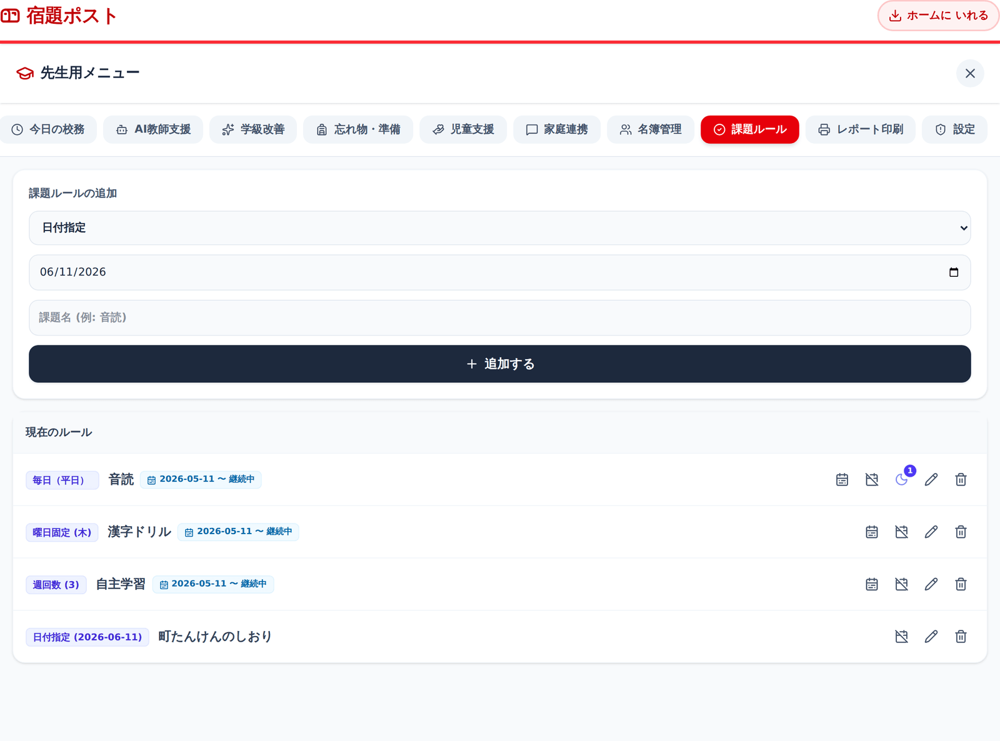

登録済みの課題は、出し方と有効期間が横に並んで表示されます。

### 4つの出し方から選んで課題を追加する

1. いちばん上の選ぶ欄から、出し方を選んでください。
2. 出し方に応じて出てくる欄（日付、曜日、週の回数）を埋めてください。
3. 「課題名」に、児童の画面に出す名前を入力してください（例: 音読）。
4. 「追加する」を押してください。

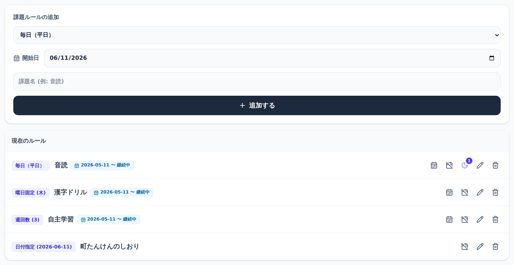

「毎日（平日）」を選ぶと、開始日の欄が出ます。

選べる出し方は4つです。

- 日付指定 … その日だけ出す課題です。期限のある提出物に使います
- 毎日（平日） … 月曜から金曜まで毎日出す課題です。音読や自主学習に使います
- 曜日固定 … 決まった曜日だけ出す課題です。週1回の漢字ドリルなどに使います
- 週の回数指定 … 「週に3回やればよい」という課題です。児童の画面には「週 2/3回」のように、その週の進み具合が出ます

【！】覚えておいていただきたいこと

- 「毎日（平日）」「曜日固定」「週の回数指定」には、登録した日が開始日として自動で入ります。その日より前は、提出率の必要回数に数えません
- 4月から出していた課題を6月に登録したときは、次の節のやり方で開始日をさかのぼって直してください
- 課題名は、あとから鉛筆のボタンで直せます

### 課題を出していた期間を決める（開始日・終了日）

登録した日より前から出していた課題や、途中でやめた課題は、期間を決めておくと提出率が実態に合います。

1. 直したい課題の行の右にある、カレンダーのボタンを押してください。
2. 「開始日（この日から）」に、その課題を出しはじめた日を入れてください。
3. 「終了日（この日まで・任意）」は、まだ続いているなら空欄のままで構いません。
4. 「期間を保存」を押してください。

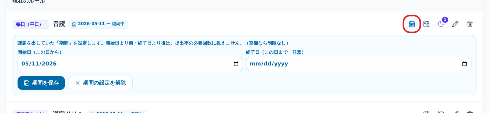

赤い枠で囲んだボタンを押すと開きます。

開始日より前と、終了日より後は、提出率の必要回数に数えません。期間の設定そのものをやめたいときは、同じ画面の「期間の設定を解除」を押してください。

このボタンは、繰り返し出す課題（毎日（平日）・曜日固定・週の回数指定）にだけ出ます。日付指定の課題には、そもそも1日しかないため出ません。

### 宿題を出さなかった日を、おやすみ日にする

校外学習や行事で宿題を出さなかった日を、1日ずつ指定できます。おやすみ日にした日は、提出率の必要回数に数えません。

1. 課題の行の右にある、斜線の入ったカレンダーのボタンを押してください。
2. 日付を選んでください。
3. 「おやすみ日に追加」を押してください。

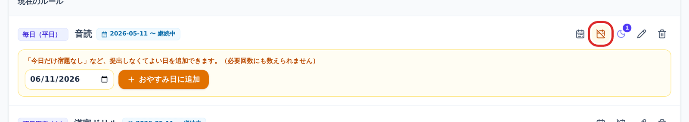

追加したおやすみ日は、課題の下に日付の札で並びます。

札の右にある小さな印を押すと、おやすみ日の設定を取り消せます。

提出率が実態より低く出るとき、その多くは、宿題を出していない日まで必要回数に数えていることが原因です。アプリの側でも、その候補を自動で洗い出します。

1. 課題の行の右にある、月の形のボタンを押してください。数字の付いている課題にだけ出ます。
2. 提案された日付と、その日の提出率を確かめてください。
3. その日は宿題を出していなかったのなら「おやすみに」を押してください。まとめて採用するときは「すべておやすみ」を押してください。
4. その日は本当に提出が必要だったのなら、右の小さな印を押して提案を消してください。

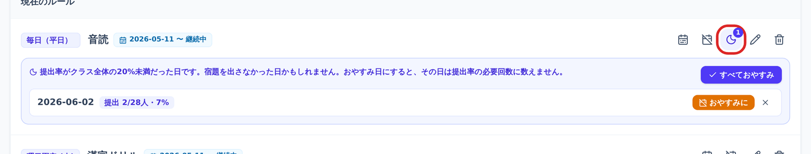

提案の数は、月の形のボタンの右上に出ます。

提案に出るのは、提出率がクラス全体の20パーセントに満たなかった日です。さかのぼって調べるのは過去60日ぶんで、1つの課題につき12件までです。提出率の母数は、在籍している児童から、その日の欠席者を引いた人数です。遅刻は登校しているので母数に含めます。

なお、週の回数指定の課題には提案が出ません。週の中で提出日を選ぶ課題なので、ある日に提出が少ないのは、ふつうの状態だからです。

### 課題を終了する・完全に削除する

学期が変わって出さなくなった課題は、終了しておきます。

現在のルールの右にあるごみ箱のボタンを押すと、その課題を終了します。誤操作を防ぐため、PINコードの入力を求められます。

終了した課題は「終了した課題」の一覧に移ります。それまでの提出記録と集計はレポートに残り、必要なら一覧から復元できます。

同じ一覧から「完全削除」を選ぶと、レポートの集計対象からも取り除きます。児童の提出記録そのものは残りますが、集計には出てこなくなります。こちらもPINコードの入力が必要です。

## 子どもが毎朝する３つの操作（受付の端末）

児童が朝に行う操作は3つだけです。全部でおおむね10秒です。ここは、児童に説明するときの手順としてお読みください。

### 出席番号を打って OK を押す

1. テンキーで自分の出席番号を打ちます。
2. 赤い「OK」を押します。

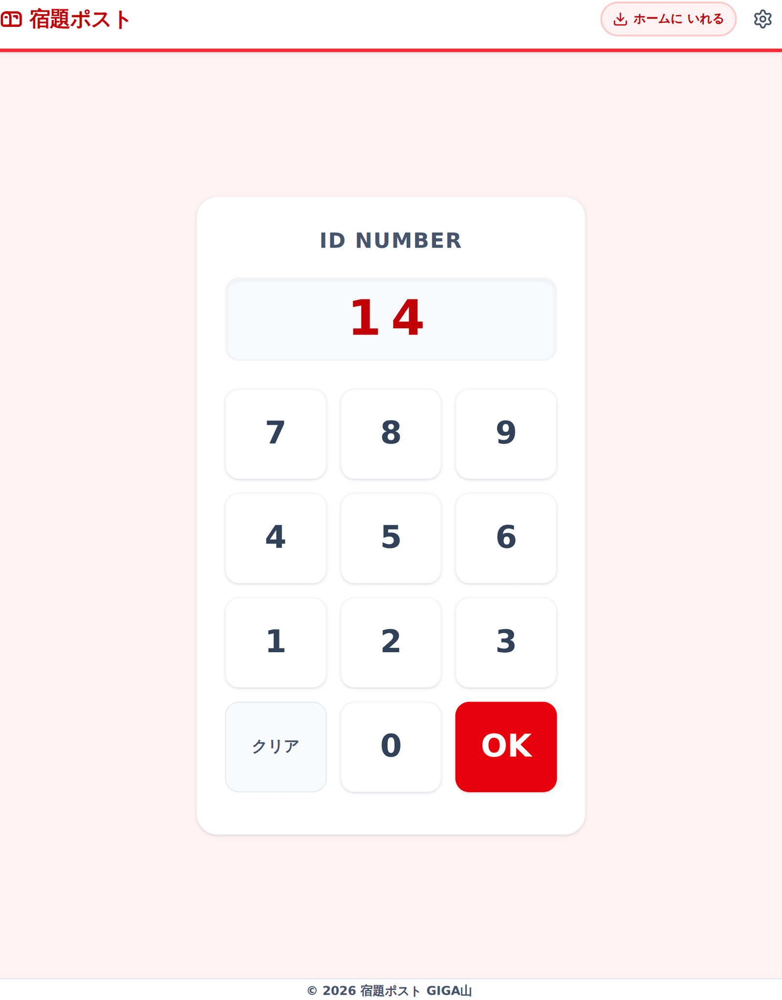

打ち間違えたときは「クリア」で消せます。

名簿に無い番号を打つと「IDがみつかりません」と出ます。番号を確かめて打ち直してください。

### 今日だすものを選ぶ

自分の名前が出て、その日に出す課題が並びます。持ってきたものを押して選びます。

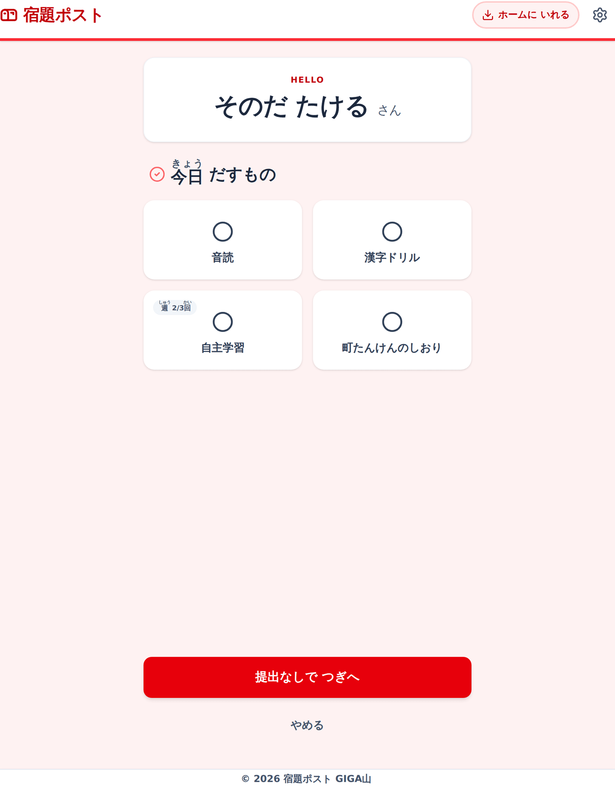

週の回数指定の課題には、その週の進み具合が左上に出ます。

1. 出したものを押します。押すと赤くなります。
2. 複数あるときは、いくつでも押せます。もう一度押すと選択を外せます。
3. 下の「つぎへ」を押します。

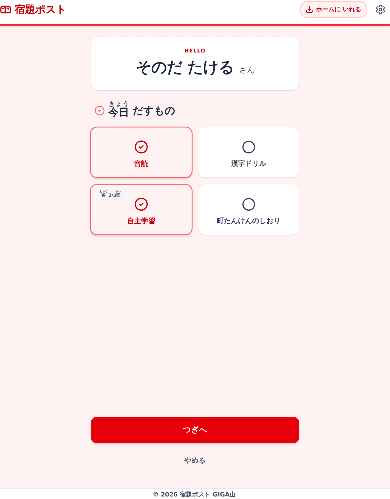

選んだものは赤い枠と印で分かります。

すでに提出済みの課題は灰色になり、押せません。

週の回数指定の課題は、その週の回数に達すると一覧から消えます。「週に3回」の課題を3回出した児童には、その週のあいだ、その課題が出なくなります。

### いまの「きもち」を選ぶ

朝の健康観察です。4つから1つを選びます。

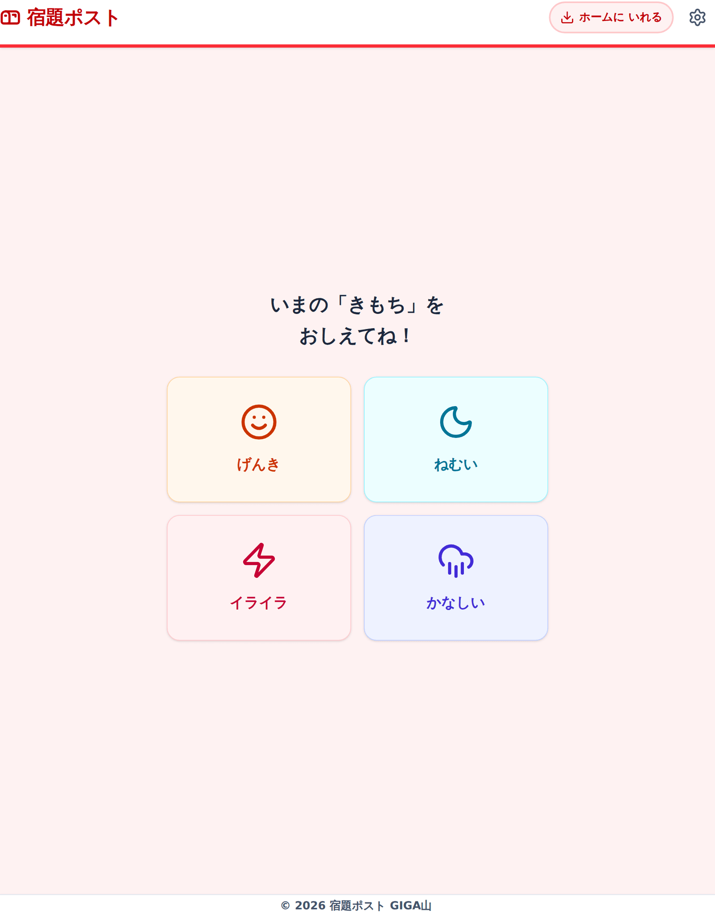

げんき、ねむい、イライラ、かなしい の4つです。

選ぶと「提出完了」が出て、3秒ほどで受付画面に戻ります。次の児童は、そのまま自分の番号を打てます。

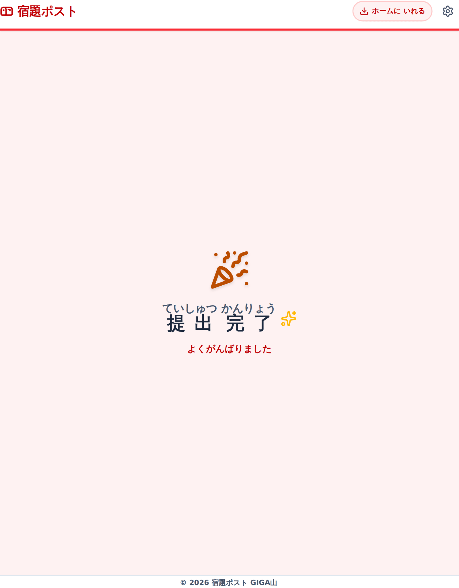

3秒ほどたつと、自動で受付画面に戻ります。

出すものが無い日や、忘れてしまった日は、何も選ばずに「提出なしで つぎへ」を押して進みます。ボタンの文字は、何も選んでいないときだけこの言葉に変わります。

このときも、きもちの記録は残ります。宿題を忘れた児童が朝の健康観察から外れてしまわないよう、こうしてあります。

途中でやめたいときは、いちばん下の「やめる」を押すと受付画面に戻ります。

## その日の記録を見る、あとから記録する（ダッシュボード）

その日の提出・きもち・出欠を、一覧で見る画面です。児童が端末を触れなかったときの記録も、ここから入れます。

### 表示する期間を切り替える

いちばん上の「表示期間」で、見たい期間を選びます。今日、今週、今月、先月、期間指定の5つから選べます。期間指定を選ぶと、左右の日付の欄で自由に決められます。

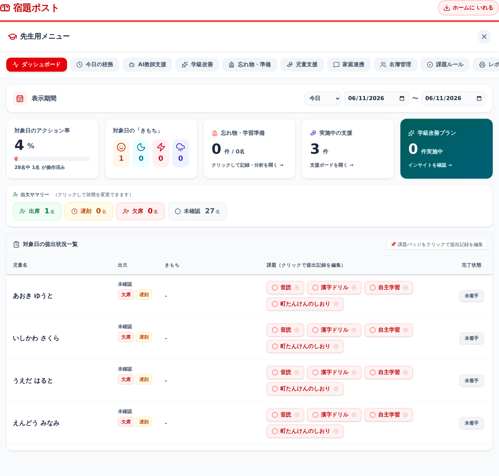

上から、表示期間、その日の集計、出欠サマリー、提出状況の一覧です。

1日だけを表示しているときは、児童ごとの一覧に出欠ときもちが出ます。何日かをまとめて表示しているときは、期間内の提出の回数がまとまって出ます。

### 課題バッジを押して、提出をあとから記録する

児童が端末を触れなかった日や、記録し忘れた日は、先生が代わりに記録できます。

1. 表示期間をその日に合わせてください。
2. 一覧から、その児童の行を探してください。
3. 課題名の札（バッジ）を押してください。押すと提出済みになります。

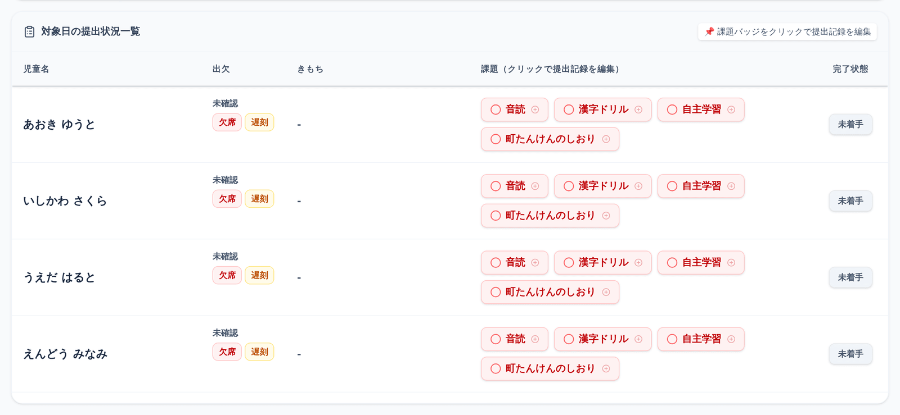

課題名の札を押すと、その場で提出済みになります。

間違えて押したときは、もう一度同じ札を押すと取り消せます。

### 欠席・遅刻を記録する

提出もきもちも記録がない児童の行には、「欠席」「遅刻」のボタンが出ます。押すと、その日の出欠として記録されます。

すでに提出やきもちの記録がある児童は、登校しているものとして自動で「出席」になります。この場合、出欠をあとから変更することはできません。

【！】覚えておいていただきたいこと

- 欠席や遅刻として記録した児童は、その日の「提出の残り」（今日の校務）に数えません
- おやすみ日の提案では、欠席の児童だけを母数から外します。遅刻は登校しているので母数に含めます
- レポートの提出率は、欠席した日も必要回数に数えます。長く休んだ児童の資料を作るときは、集計期間を休みの前後で分けてください
- 記録を取り消したいときは、同じ行のボタンをもう一度押してください

## 朝の会のあとに開く（今日の校務）

その日にやることが、優先順に並ぶ画面です。朝の会が終わったらここを開けば、ほかのタブを順に見て回る必要はありません。

### 今日やることを優先順に見る

いちばん上に「朝の確認進捗」が出ます。提出・きもち・出欠のどれかが記録された児童の割合です。

その下に、きもちの個別確認、提出の残り、今日の忘れ物、期限付きフォローの4つの数が並びます。さらに下に、確認が必要な事がらがカードで並びます。

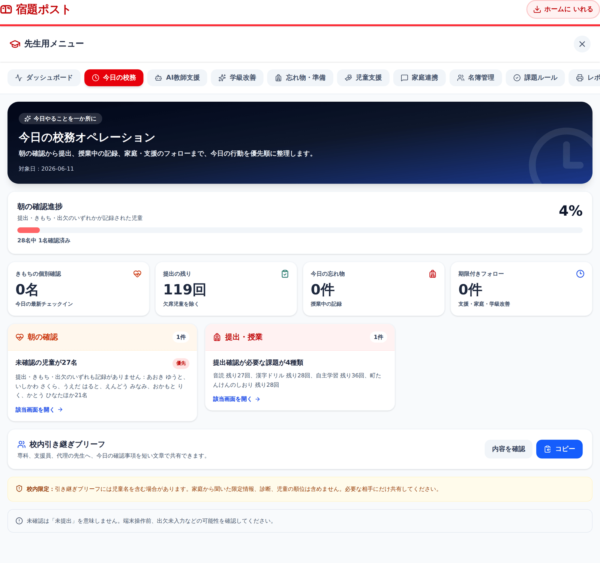

カードの「該当画面を開く」を押すと、直すべきタブへそのまま移動します。

期限付きフォローには、児童支援の振り返り予定日と、家庭連携の次回確認日と、学級改善プランの振り返り日が、予定日を過ぎたものだけ出ます。

### 校内引き継ぎブリーフを専科・支援員へ渡す

専科の先生や支援員の先生、代理で入る先生に、その日の確認事項を短い文章で渡せます。

1. 画面の下にある「校内引き継ぎブリーフ」の「内容を確認」を押してください。
2. 出てきた文章を読み、渡してよい内容か確かめてください。
3. 「コピー」を押してください。文章がコピーされます。
4. 学校で使っているチャットやメールに貼り付けて渡してください。

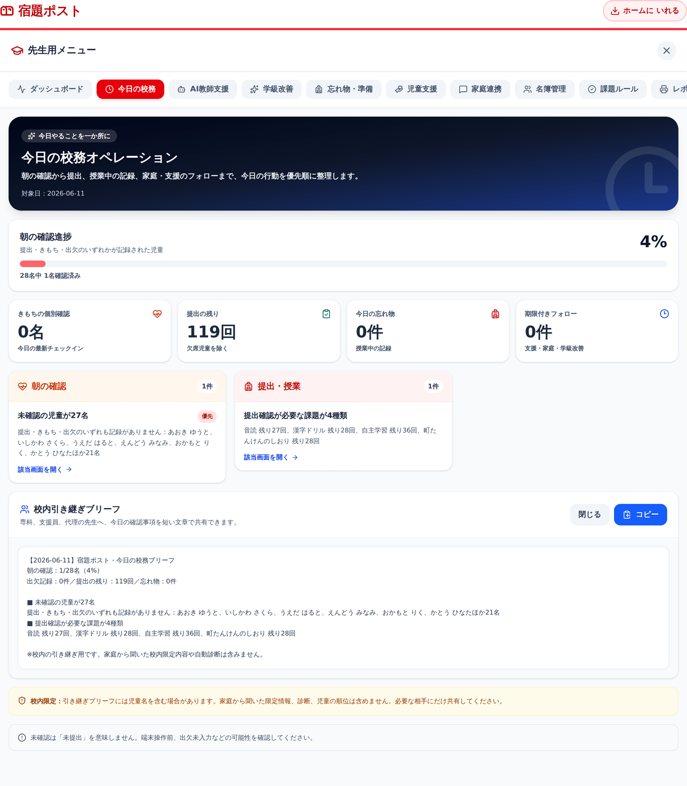

コピーする前に、必ず中身を目で確かめてください。

【！】覚えておいていただきたいこと

- ブリーフには児童名が入ることがあります。渡す相手を確かめてください
- 家庭から聞いた校内限定の内容と、自動の診断は入りません
- 見終わったら「閉じる」で畳めます

## 忘れ物と授業の準備を記録する（忘れ物・準備）

児童を評価するための記録ではありません。準備で困る場面を見つけて、時間割や持ち物案内の見せ方を見直すための記録です。

### 直近28日のまとまりを見る

画面の上に、直近28日の件数、困った児童の人数、授業に影響がなかった割合が出ます。その下に「支援につなげるヒント」が出て、目立っている教科と品物を知らせます。

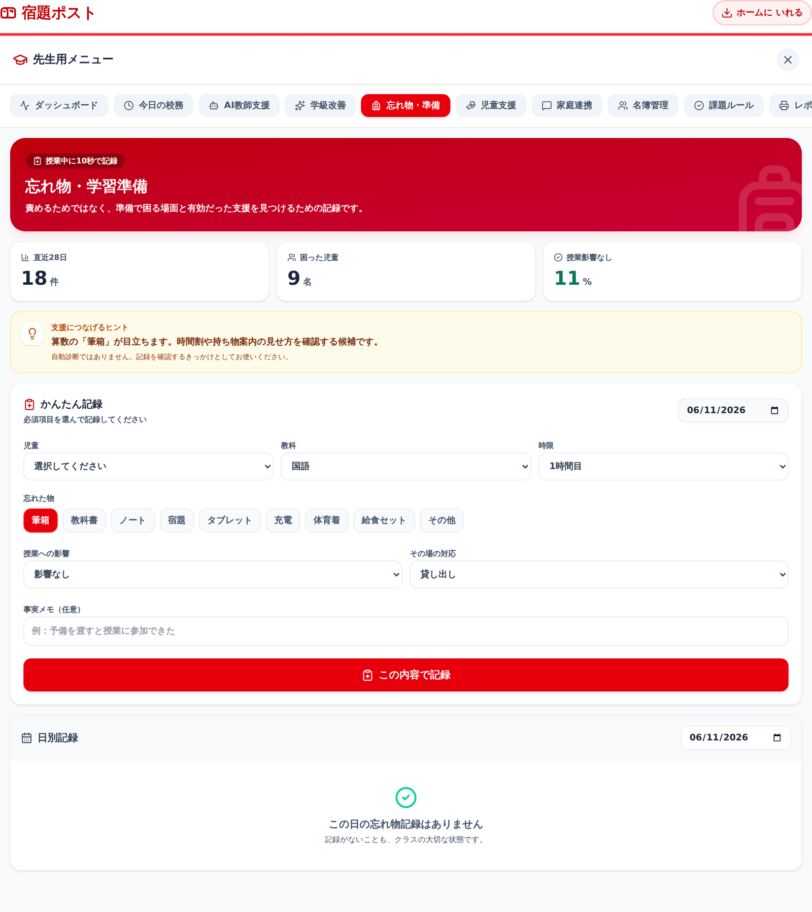

上から、28日の集計、ヒント、かんたん記録、日別記録です。

ヒントは自動の診断ではありません。記録を確かめるきっかけとしてお使いください。

### 授業中に、その場で1件を記録する

授業の途中でも、選ぶだけで1件を記録できます。文章を書く必要はありません。

1. 「児童」から、忘れた児童を選んでください。
2. 「教科」と「時限」を選んでください。
3. 「忘れた物」から1つを押してください。筆箱、教科書、ノート、宿題、タブレット、充電、体育着、給食セット、その他の9つがあります。
4. 「授業への影響」を選んでください。影響なし、少し困った、参加が難しかった の3つです。
5. 「その場の対応」を選んでください。貸し出し、友達と共有、代用品、家庭へ連絡、本人と確認、その他 の6つです。
6. 「この内容で記録」を押してください。

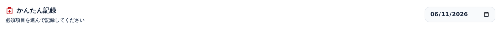

「事実メモ」は任意です。空欄のままでも記録できます。

記録した内容は、画面の下の「日別記録」に並びます。日付を変えると、その日の記録を見られます。

## 気になる子への一手を記録する（児童支援）

気づいたことを、そのまま次の一手までつなぐための画面です。自動で表示される候補は診断でも順位付けでもなく、先生が確認するきっかけです。

### 今日の確認候補から児童を選ぶ

画面の左に「今日の確認候補」が並びます。振り返りの期限が来た児童と、最近の記録から気になる児童が出ます。名前を押すと、右側がその児童に切り替わります。

右上の選ぶ欄から、名簿の順に児童を選ぶこともできます。

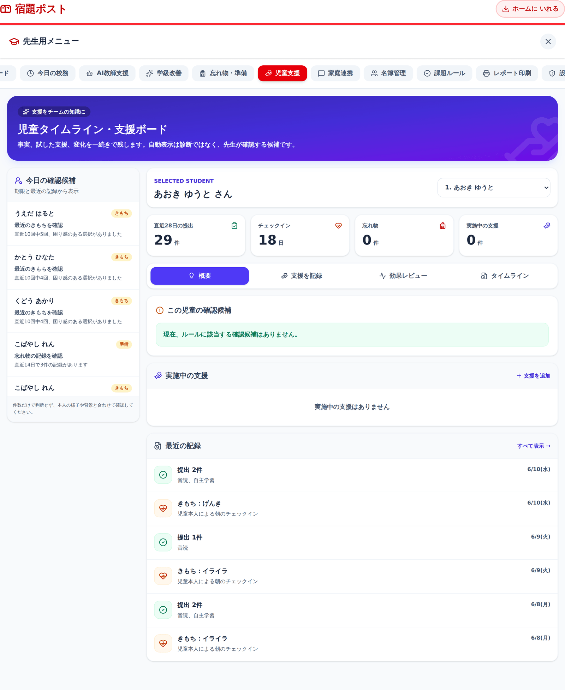

左が確認候補、右が選んだ児童の記録です。

選んだ児童について、直近28日の提出、チェックインの日数、忘れ物、実施中の支援の数が4つの箱に出ます。

### 事実と支援と目標を分けて記録する

評価の言葉ではなく、見聞きした事実と、具体的に試すことを分けて残します。

1. 「支援を記録」を押してください。
2. 分類を1つ押してください。学習準備、課題提出、学習、生活・体調、友人関係、その他 の6つです。
3. 「記録日」と「振り返り予定日」を決めてください。振り返り予定日が来ると「今日の校務」で知らせます。
4. 「確認した事実」に、いつ何があったかを書いてください。
5. 「学校で試す支援」に、学校でやってみることを書いてください。
6. 「目指す状態」に、どうなったらよいかを書いてください。
7. 「支援計画を開始」を押してください。

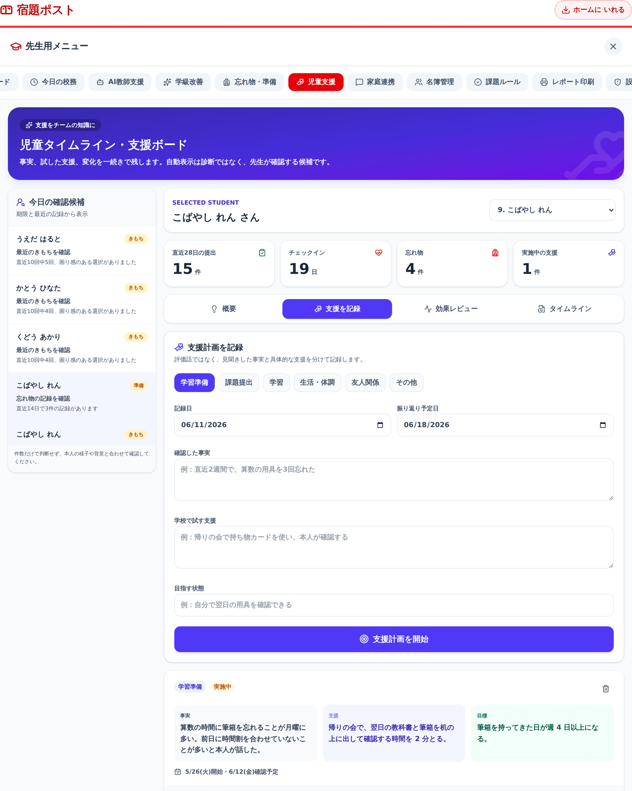

それぞれの欄に、書き方の例が薄い文字で出ています。

記録した支援は、その下に「実施中」として並びます。

### 支援の前後を同じ日数で比べる（効果レビュー）

始めた支援について、その前と後を同じ日数で比べます。

「効果レビュー」を押すと、支援を始めてからの日数と同じ日数を開始前から取り、最大14日ずつで比べた結果が出ます。忘れ物の件数と課題提出率が、支援前と支援後で並びます。

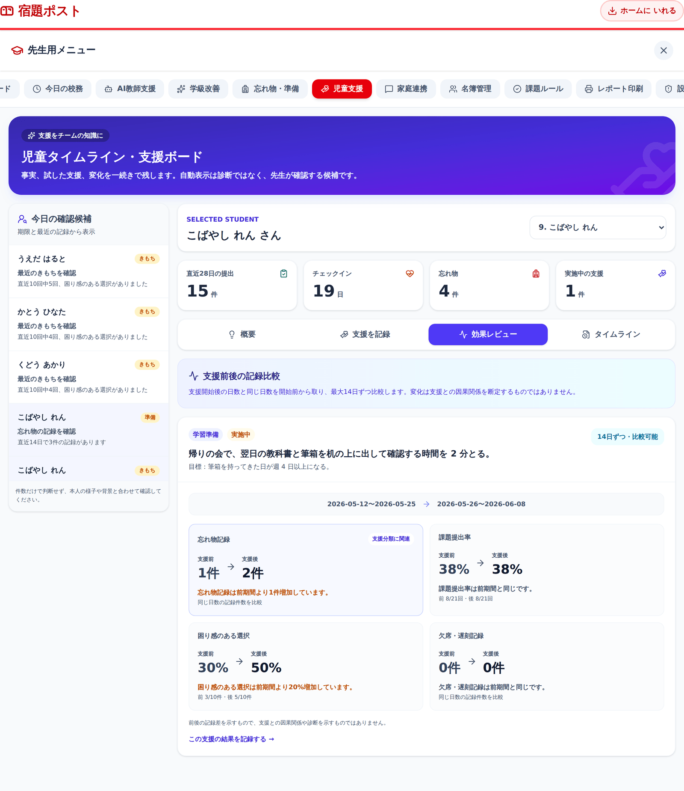

比べた期間の日付が、まん中に出ます。

比べられる日数が7日に満たないときは、その旨が表示されます。ここに出る数字は、支援と結果の因果関係を示すものではありません。学級の様子と合わせてお読みください。

### 一人ぶんの記録を時系列で読む（タイムライン）

「タイムライン」を押すと、その児童の提出、朝のきもち、出欠、忘れ物、支援が、時系列で並びます。

面談の前や、学年でその児童について話し合う前に、ここを上から読むと経過をたどれます。

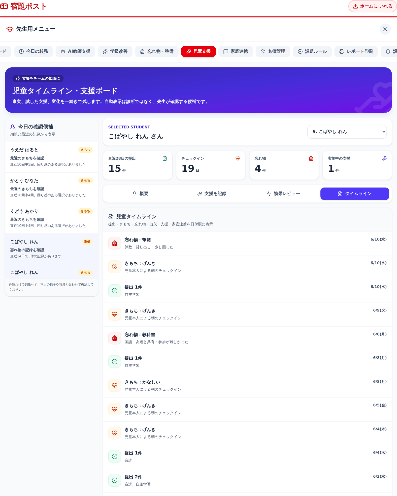

新しい記録が上に来ます。

家庭から聞いた校内限定の内容は、このタイムラインには出ません。

## 家庭とのやり取りを記録する（家庭連携）

電話、面談、連絡帳、メールなどのやり取りを記録して、対応漏れを防ぐ画面です。

### 連絡した事実と合意した対応を残す

1. 右上の選ぶ欄から児童を選んでください。
2. 「連絡日」「連絡手段」「話題」を選んでください。
3. 「学校から共有した事実」に、学校から伝えたことを書いてください。
4. 「家庭から聞いたこと」に、ご家庭から伺ったことを書いてください。
5. 「学校・家庭で合意した対応」に、決まったことを書いてください。
6. 「家庭連携を記録」を押してください。

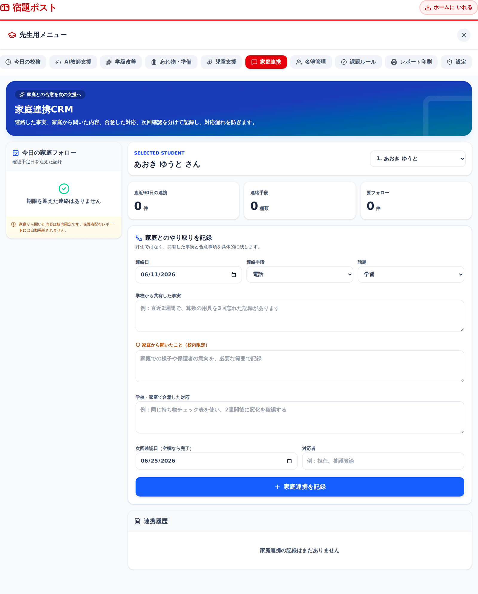

「対応者」は任意です。担任以外が対応したときに使います。

【！】覚えておいていただきたいこと

- 「家庭から聞いたこと」は校内限定として扱います。保護者に配るレポートにも、児童タイムラインにも出ません
- 記録したものは、いちばん下の「連携履歴」に並びます
- 話題と連絡手段は、あとから集計され、直近90日の件数として上に出ます

### 次回確認日を入れて、対応漏れを防ぐ

「次回確認日」に日付を入れておくと、その日が来たときに「今日の校務」の期限付きフォローに出ます。

まだ様子を見る必要があるときは日付を入れ、これで終わりでよいときは空欄のままにしてください。空欄にすると、その記録は完了として扱われます。

画面の左には「今日の家庭フォロー」が出ます。確認予定日を迎えた記録だけがここに並びますので、朝にここを見れば、返事を待たせている家庭が分かります。

## 学級全体の変化を見て、改善プランを作る（学級改善）

直近14日間を前の14日間と比べて、学級全体で確認したい変化と、今週試せる改善候補を出す画面です。児童名や個人の順位は出ません。

### 直近14日を前の14日と比べる

画面の上に、分析した期間が出ます。その下に、課題提出率、困り感のある選択の割合、忘れ物の件数、支援の確認期限の4つが並び、それぞれ前の14日間からどれだけ動いたかが出ます。

さらに下に「今週の改善候補」が並びます。1つの候補は、根拠と、試すことと、確認指標の3つでできています。

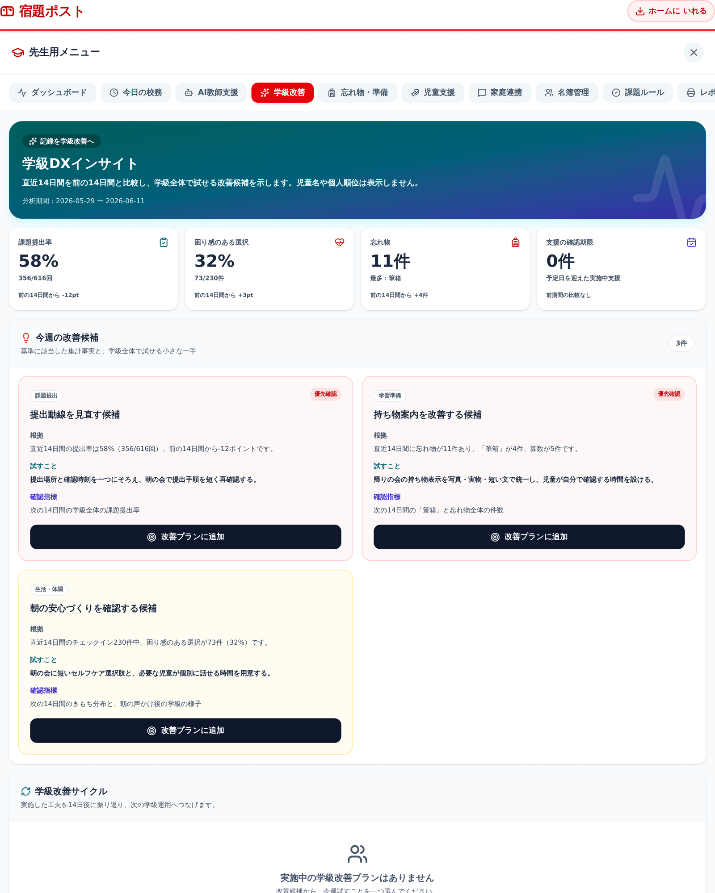

根拠には、その候補が出た集計の数字がそのまま書かれています。

根拠の数字は、この画面の上に出ている集計と同じものです。数字に納得できないときは、課題ルールの期間やおやすみ日を先に見直してください。

### 改善候補を「実施中のプラン」に変える

試すと決めた候補は、期限付きのプランにして残せます。

1. 試す候補の「改善プランに追加」を押してください。
2. 画面の下の「学級改善サイクル」に、実施中のプランとして並びます。
3. 14日後に振り返る予定日が自動で入ります。予定日が来ると「今日の校務」で知らせます。
4. 振り返るときは、そのプランに結果を書いて「振り返りを保存」を押してください。

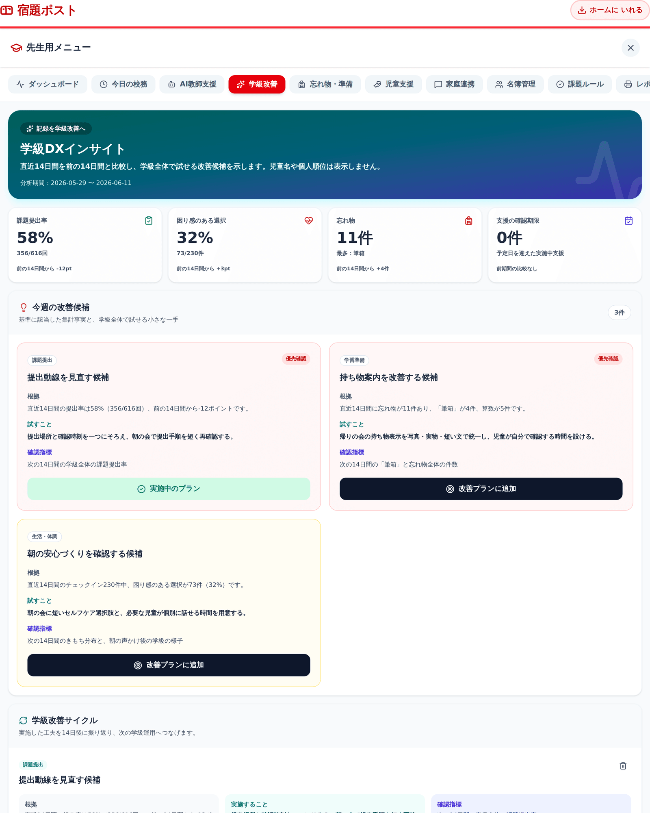

同じ候補を二重に追加することはできません。

やめたプランは、右のごみ箱のボタンで削除できます。削除する前に確認の画面が出ます。

## 紙にして渡す（レポート印刷）

児童ごとにA4一枚の資料を作って印刷します。渡す相手に合わせて、3種類から選びます。

### 3種類の資料から選ぶ

いちばん上の「資料の種類」で選びます。

- 学期末レポート … 提出状況と朝のきもちを詳しく載せます。手書き用のコメント欄が付きます。児童と保護者に渡すものです
- 保護者面談サマリー … 学習・生活・学校の支援をA4一枚に集約します。教師の観察メモと振り返り予定日は載りません。保護者に渡すものです
- 校内支援ケース資料 … 事実・支援・振り返り期限まで載せます。校内限定・取扱注意のものです

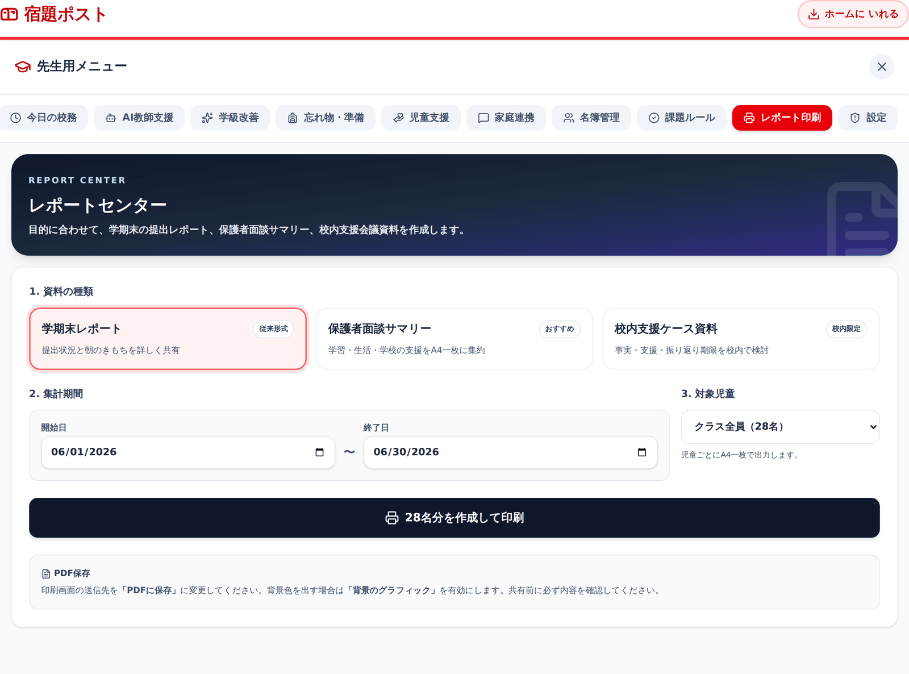

上から、資料の種類、集計期間、対象児童の順に決めます。

### 集計期間と対象児童を決めて印刷する

1. 「集計期間」の開始日と終了日を決めてください。既定では、今月の1日から末日までが入っています。
2. 「対象児童」で、クラス全員か、1名かを選んでください。
3. いちばん下の「作成して印刷」を押してください。ブラウザの印刷画面が開きます。

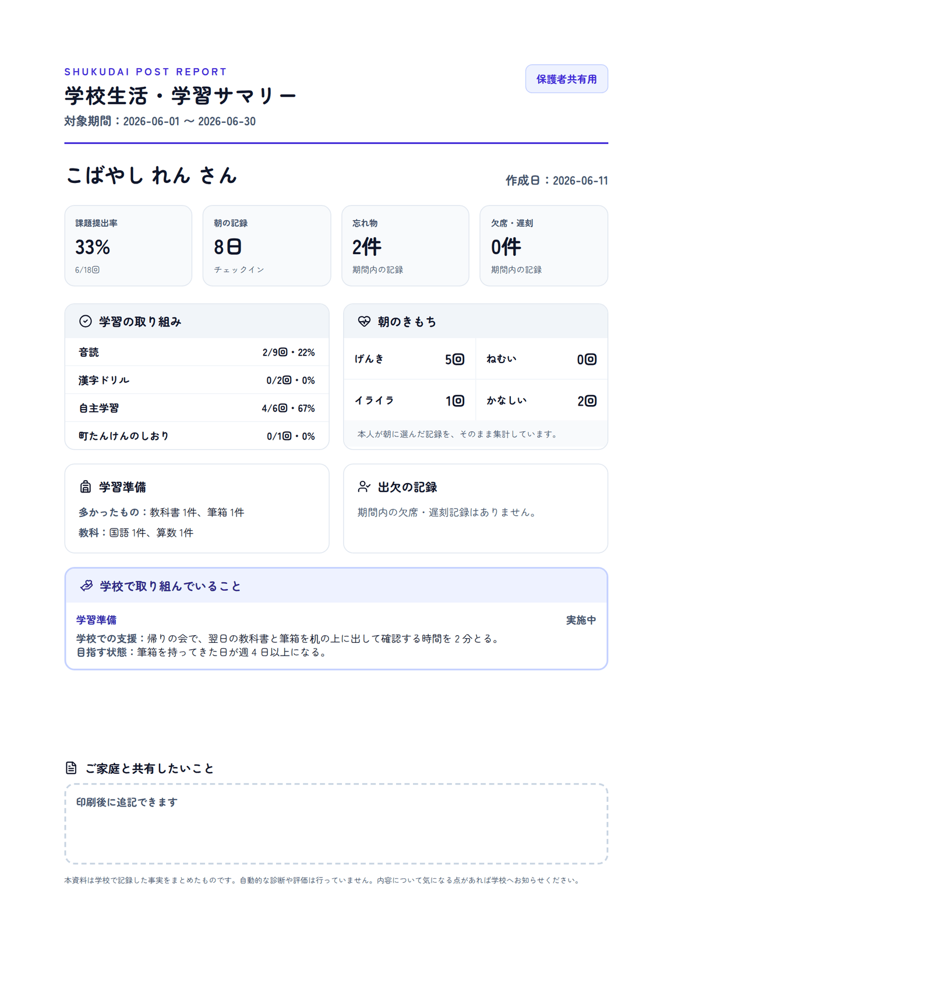

児童ごとにA4一枚で出ます。

集計期間に、まだ来ていない日が入っていても、その日は必要回数に数えません。月の途中で印刷しても、提出率が実態より低く出ることはありません。

クラス全員を選ぶと、人数のぶんだけ紙が出ます。28名なら28枚です。印刷の前に、枚数を確かめてください。

紙に刷らずにファイルで残したいときは、ブラウザの印刷画面で送信先を「PDFに保存」に変えてください。

背景の色や帯を出したいときは、同じ印刷画面で「背景のグラフィック」を有効にしてください。既定では背景が省かれ、白い紙に文字だけが出ます。

保護者や校内に渡す前に、必ず中身を目で確かめてください。とくに校内支援ケース資料は取扱注意です。印刷したものの保管と廃棄にもご注意ください。

## 記録を守る、別の端末でも同じ記録を見る（設定）

記録はその端末の中だけに残ります。端末が壊れたときや、別の端末でも同じ記録を見たいときのための画面です。

### 設定の画面を開く

先生用メニューの「設定」タブを押してください。上から、セキュリティ設定、データのバックアップと復元、自動復元ポイント、複数端末でのデータ同期、年度更新の順に並びます。

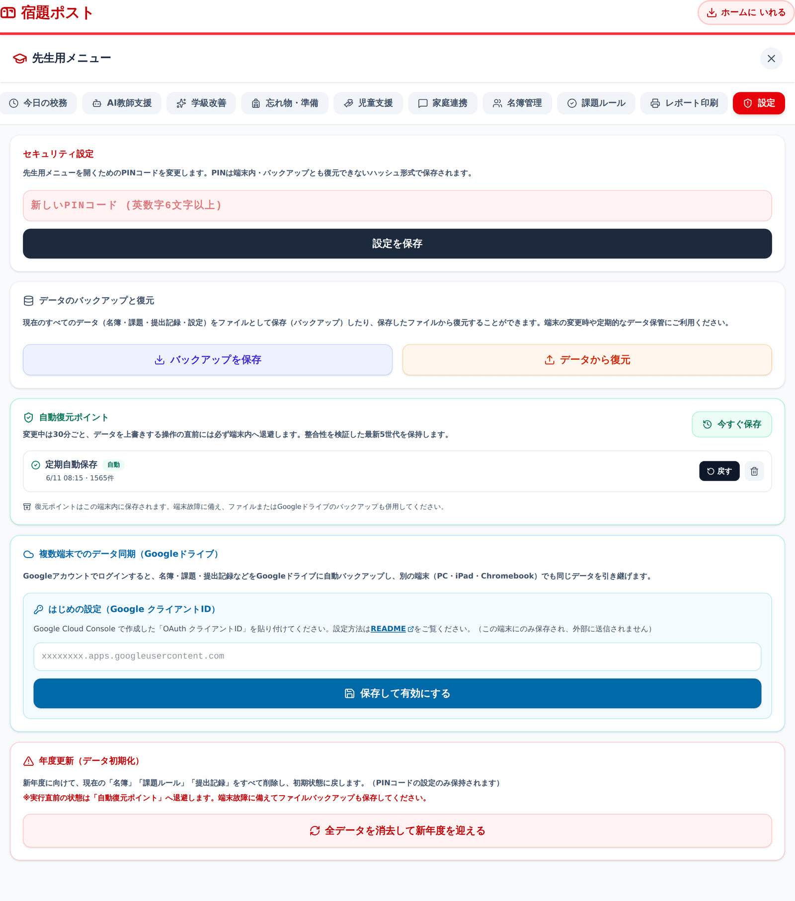

いちばん上がPINコードの変更です。

### ファイルにバックアップを取る、戻す

「バックアップを保存」を押すと、いまのすべての記録（名簿・課題・提出記録・設定）が1つのファイルとして端末に保存されます。学期に一度は取って、職員室の共有フォルダなど、端末とは別の場所に置いてください。

戻すときは「データから復元」を押し、保存しておいたファイルを選んでください。

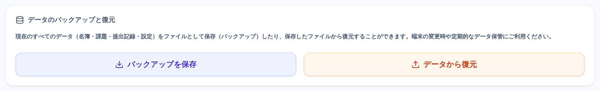

端末を入れ替えるときも、この2つを使います。

【！】覚えておいていただきたいこと

- 復元すると、いまの記録はファイルの中身で置き換わります。復元の直前の状態は、自動で復元ポイントに退避されます
- PINコードの設定はハッシュのまま入っています。復元するとPINコードもファイルのときのものに戻ります
- AI教師支援の接続設定は、バックアップにも同期にも含まれません

### 自動復元ポイントから戻す

記録を消してしまったときは、端末の中に自動で取ってある控えから戻せます。

変更しているあいだは30分ごとに、ファイルやクラウドからの復元と年度更新の直前には必ず、控えが端末の中に保存されます。最新の5世代まで残ります。

1. 「自動復元ポイント」の一覧から、戻したい時刻のものを探してください。
2. 右の「戻す」を押してください。
3. 何件から何件に変わるかを確かめる画面が出ます。よければ進めてください。

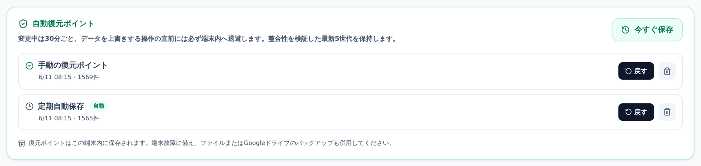

自分のタイミングで作るときは「今すぐ保存」を押してください。

戻す操作の直前の状態も、自動で復元ポイントに退避されます。戻したあとで「やはり元に戻したい」となっても、もう一度戻せます。

【！！】覚えておいていただきたいこと

復元ポイントは、この端末の中にあります。端末が壊れると、記録と一緒に消えます。ファイルのバックアップか、次の節のGoogleドライブ同期と、必ず併用してください。

### 複数の端末で同じ記録を使う（Googleドライブ同期）

教室の端末と職員室のパソコンで同じ記録を見たいときは、Googleドライブ同期を設定します。

設定には、学校または設置者が用意した Google のクライアントID（OAuth クライアントID）が要ります。作り方はリポジトリの README にあります。情報担当の先生にご相談ください。

1. 「複数端末でのデータ同期（Googleドライブ）」の入力欄に、クライアントIDを貼り付けてください。
2. 「保存して有効にする」を押してください。
3. 出てきた案内にしたがって、Googleアカウントでログインしてください。

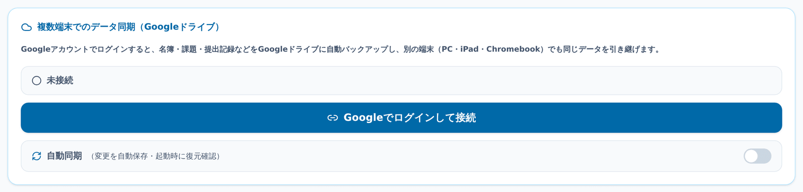

クライアントIDはこの端末にだけ保存され、外部に送信されません。

Google のログイン画面が出たときに、見慣れない確認や許可を求める画面が続くことがあります。これは、このアプリが先生のドライブの中に記録のファイルを置くための許可を求めるものです。学校で使ってよいと決まっているアカウントで進めてください。

教室の端末でも職員室のパソコンでも記録を足したときは、どちらを残すかを選ぶ画面が出ます。自動で上書きすることはありません。

件数の差を見て、「クラウド版を採用」か「この端末版を採用」のどちらかを選んでください。選ばなかったほうも復元ポイントに退避されますので、あとから戻せます。

迷ったときは、件数の多いほうを採用して、足りない記録をダッシュボードから手で入れ直すほうが確実です。

## 【！！】年度が変わったときの初期化（もとに戻せません）

新年度に向けて、学級の記録をすべて消して初期状態に戻す操作です。年に一度しか使いません。この節は、実行する日に読んでください。

### 実行する前に必ずすること

初期化すると、名簿・課題ルール・提出記録・きもち・出欠・忘れ物・児童支援・学級改善・家庭連携・AI利用履歴が、すべて消えます。

実行の直前に自動で復元ポイントは作られますが、それは端末の中にしかありません。端末を入れ替える時期でもあるため、必ず先に「バックアップを保存」でファイルをお手元に取ってください。

前年度のレポートを紙かPDFで残す必要があるなら、それも初期化の前に印刷しておいてください。

### データを初期化する

1. 「設定」タブのいちばん下、「年度更新（データ初期化）」まで画面を送ってください。
2. 「全データを消去して新年度を迎える」を押してください。
3. 確認の画面が出ます。内容を読んでください。
4. PINコードを入力してください。

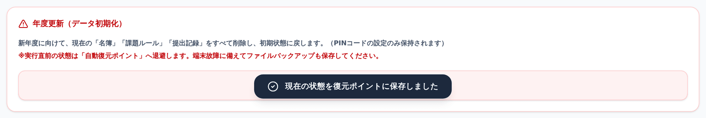

PINコードを入れないと実行されません。

PINコードの設定だけは、初期化しても残ります。新年度も同じPINコードで先生用メニューに入れます。

【！！】最重要注意事項

消した記録は、この画面からは戻せません。戻す方法は、初期化の直前に作られた復元ポイントか、お手元に保存したバックアップのファイルだけです。復元ポイントは端末の中にしかありませんので、端末を入れ替えるのであれば、ファイルのバックアップが唯一の手立てになります。

## AI教師支援を使う場合（任意・上級者向け）

この章は、生成AIで下書きを作りたい学校のためのものです。設定しなければ、この画面から何かが送信されることはありません。児童の入力と日常の記録は、設定しなくても全部使えます。通常の利用では、この章の操作は不要です。

### 使う前に決めておくこと

Gemini のAPIキーを、この画面に貼ってはいけません。このアプリは誰でも中身を読める形で配信されているため、貼った鍵はそのまま漏れます。

学校または設置者が管理する Google Cloud の Cloud Run に、リポジトリに入っている中継用のプログラム（server/gemini-proxy）を置き、鍵はそちらで管理してください。置き方はそのフォルダの README にあります。

あわせて、学校・自治体の生成AI利用規程と、保護者への説明を必ず確認してください。ここは情報担当の先生と管理職の先生にご相談ください。

### 接続を設定して、下書きを作る

1. 「AI教師支援」タブを開いてください。
2. 右の「安全な接続設定」に、Cloud Run のURLを入力してください。
3. ゲートウェイトークンを入力してください。24文字以上必要です。
4. 「この端末に保存」を押してください。
5. 左上の4つから、作りたいものを選んでください。週次サマリー、保護者面談、校内引き継ぎ、支援記録 の4つです。
6. 「Geminiへ送る内容」に出ている中身を読んでください。
7. 「上記の送信内容に、不要な個人情報がないことを確認しました」にチェックを入れてください。
8. 「確認した内容で下書きを作成」を押してください。

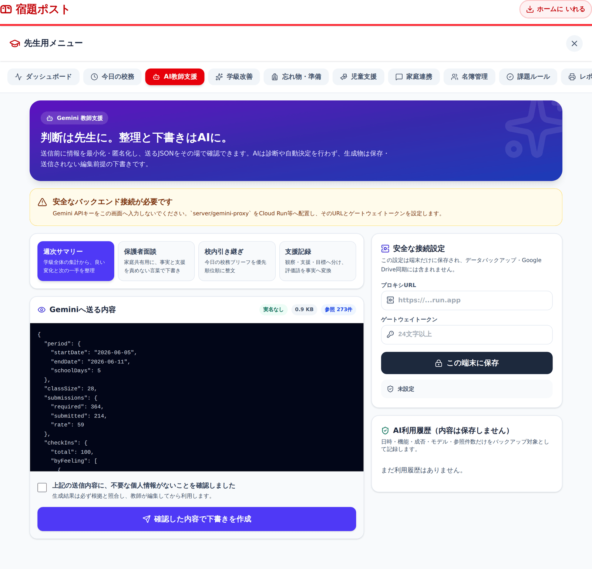

送る中身は、押す前にそのまま画面に出ます。

チェックを入れずに押すと「送信内容を確認し、確認欄にチェックしてください」と出て、送信されません。

【！】覚えておいていただきたいこと

- 児童名と連絡先は仮名に置き換えてから送ります。実名が残っていると、ボタンそのものが押せなくなります
- 出てくるのは下書きです。必ず根拠と照らし合わせ、先生が直してから使ってください。AIは診断も順位付けも自動送信もしません
- 利用履歴には、日時・機能・成否・モデル・参照した件数だけが残ります。送った内容と生成された文章は残りません
- URLとトークンはこの端末にだけ保存され、バックアップにもGoogleドライブ同期にも含まれません

## 困ったときには

よくある症状と、その場での直し方をまとめました。上から順に、起きやすいものです。

### 「あたらしい ばんが あります」と画面の下に出た場合

アプリが新しくなっています。児童が操作していないときに「さいしんに する」を押してください。押すまで切り替わりません。

朝の受付の最中に押すと、そのとき打ちかけの入力が消えます。急ぐものではありませんので、休み時間や放課後で構いません。

### 児童が端末を触れなかった場合

「ダッシュボード」タブで表示期間をその日に合わせ、その児童の行にある課題名の札を押してください。押すと提出済みとして記録されます。

欠席や遅刻も、同じ画面のボタンから記録できます。詳しくは「その日の記録を見る、あとから記録する（ダッシュボード）」の章をご覧ください。

### 提出率が実態より低く出る場合

宿題を出していない日まで必要回数に数えていることが、いちばん多い原因です。次の順に確かめてください。

1. 「課題ルール」タブで、その課題に月の形のボタンが出ていないか見てください。おやすみ日の提案です。
2. 課題の期間を確かめてください。課題を出しはじめる前の日付が数えられていないでしょうか。
3. 個別の日は、おやすみ日として手で追加もできます。

やり方は「課題ルールを決める（課題ルール）」の章にあります。

### インターネットにつながっていない場合

一度でも開いたことがある端末なら、そのまま使えます。記録は端末の中にたまり、次に開いたときに続きから使えます。

一度も開いたことがない端末で圏外になると、次の画面が出ます。壊れてはいません。

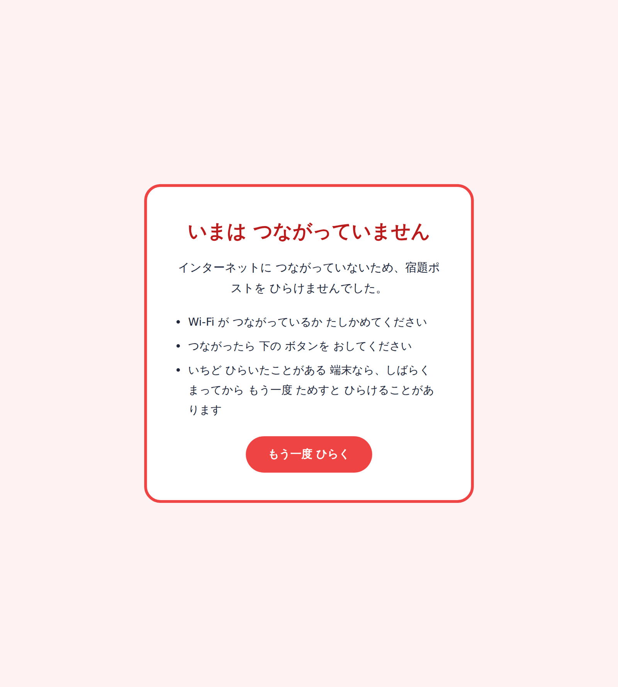

Wi-Fi がつながってから「もう一度 ひらく」を押してください。

### 端末を変えたら記録が消えた場合

記録はその端末の中に保存されます。別の端末には自動では移りません。

前の端末が手元にあるなら、そちらで「バックアップを保存」を押してファイルを取り、新しい端末の「データから復元」で読み込んでください。

これから複数の端末で同じ記録を見たいのであれば、Googleドライブ同期を設定してください。どちらも「記録を守る、別の端末でも同じ記録を見る（設定）」の章にあります。

### 記録を消してしまった場合

「設定」タブの「自動復元ポイント」から戻せます。最新の5世代まで、端末の中に残っています。

戻す前に、何件から何件に変わるかを確かめる画面が出ます。戻す操作の直前の状態も自動で退避されますので、戻しすぎても取り返せます。

### 「端末への保存に失敗しました」と出た場合

ブラウザの保存領域がいっぱいです。

まず「バックアップを保存」でファイルをお手元に取ってください。そのうえで、要らない復元ポイントを削除してください。復元ポイントの右にあるごみ箱のボタンで1つずつ消せます。

### 「IDがみつかりません」と出た場合

打った番号が名簿に登録されていません。「名簿管理」タブで、その児童の出席番号を確かめてください。

転入生の場合は、まだ登録されていない可能性があります。「個別に児童を追加」から登録してください。

### それでも解決しない場合

まず、校内でこのアプリを教えてくれた先生か、情報担当の先生にご相談ください。同じ端末と同じ学級で使っている先生がいちばん早く分かります。

校内で分からなかった場合は、このページの下にある問い合わせ先からご連絡ください。
