# 教室で使えるかもしれないもの作り #◯ 「宿題出した？」を毎朝聞いて回らない。提出も朝のきもちも十秒で終わる記録アプリ「宿題ポスト」

## 🏫 はじめに

朝の会が始まるまでの十分間、教室でいちばん時間を取られているのは宿題の確認ではないでしょうか。名簿を片手に「音読カードは出した？」「自主学習をやってきた人」と声をかけて回り、返事のなかった子をもう一度さがしにいく。ようやく全員ぶんの丸が付いたころには、子どもたちの顔をゆっくり見る時間がほとんど残っていない、ということはありませんか。

それに、確認したいのは宿題だけではないはずです。今朝はいつもより口数が少ない、なんとなく落ち着かない。そういう小さな変化のほうが、その日いちばん大事な情報だったりします。それなのに丸付けに追われているあいだに、いちばん見たいものが後回しになってしまう。この順番を入れかえられないかと考えて作ったのが、宿題ポストです。

宿題ポストは、宿題の提出確認と朝のきもちの記録を、子ども自身の手で終わらせるためのアプリです。教室のiPadやChromebookで開いておくと、登校した子が自分の出席番号を打ち、今日出すものを選び、今のきもちを選んで席に着きます。先生の手もとには、誰が何を出したか、今日の教室がどんな空気かが、朝の会が始まる時点でそろっています。

https://homework-barcordreader.giga-school.com/

ブラウザで開くだけで使えます。アプリストアからの導入も、学校でのサーバーの準備も要りません。申請を出して、許可を待って、業者に設定してもらって、という工程を一つも挟まずに、明日の朝から試せることを最優先にしました。

学校で使うものは、ネットワークが不安定なときに動かないと意味がないとも思っていました。教室のWi-Fiは、一学級が一斉に使えば重くなります。だからこのアプリは、一度開いたあとはインターネットにつながっていなくても動くようにしてあります。記録はその端末の中に貯まり、次に開いたときに続きから使えます。回線が切れた瞬間に受付の列が止まる、ということは起きません。

## 📱 このアプリでできること

まず、子どもがする操作を見てください。教室の端末には、この画面をずっと出しておきます。

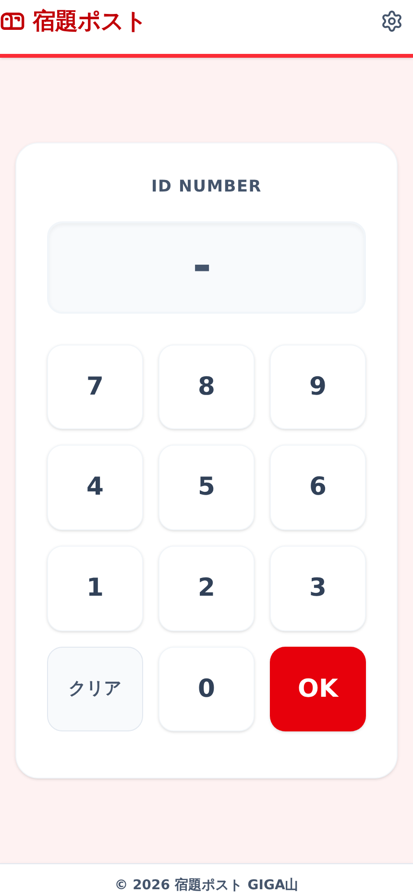

受付画面。出すのは大きなテンキーだけです。

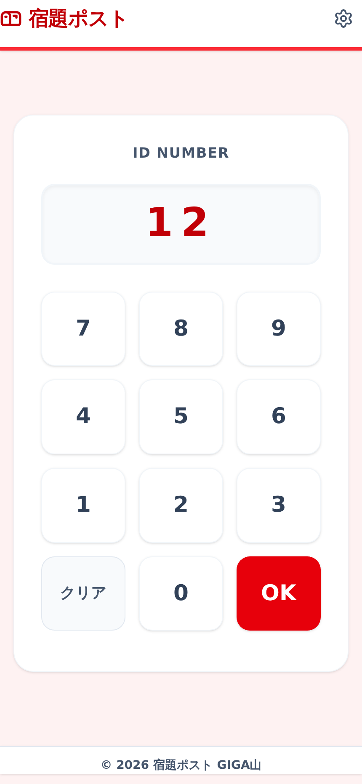

自分の出席番号を打って、OKを押します。

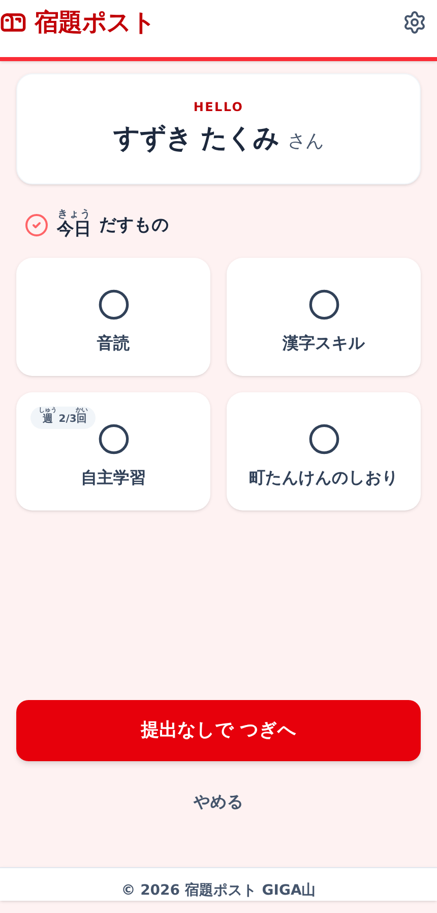

その子の名前と、今日出すものだけが並びます。曜日や週の回数から自動で絞りこんでいるので、関係のない課題は最初から出てきません。アプリが出す言葉には、ふりがなを振ってあります。

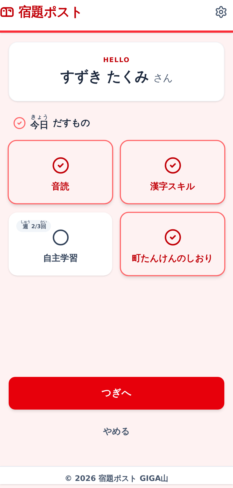

出したものを押すと赤くなります。押しまちがえても、もう一度押せば取り消せます。

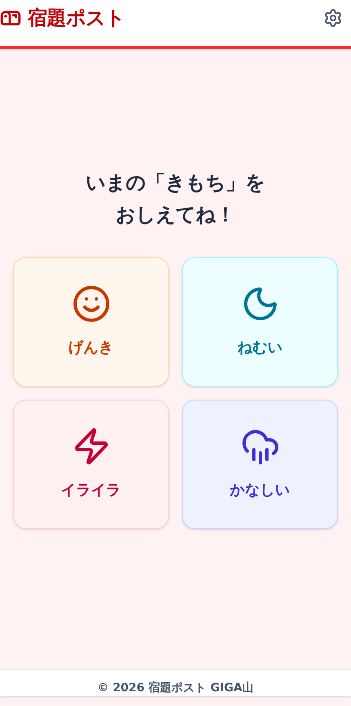

最後に今のきもちを、げんき、ねむい、イライラ、かなしいの四つから選びます。四つに絞ったのは、選択肢が増えるほど子どもが迷い、迷うほど行列ができるからです。

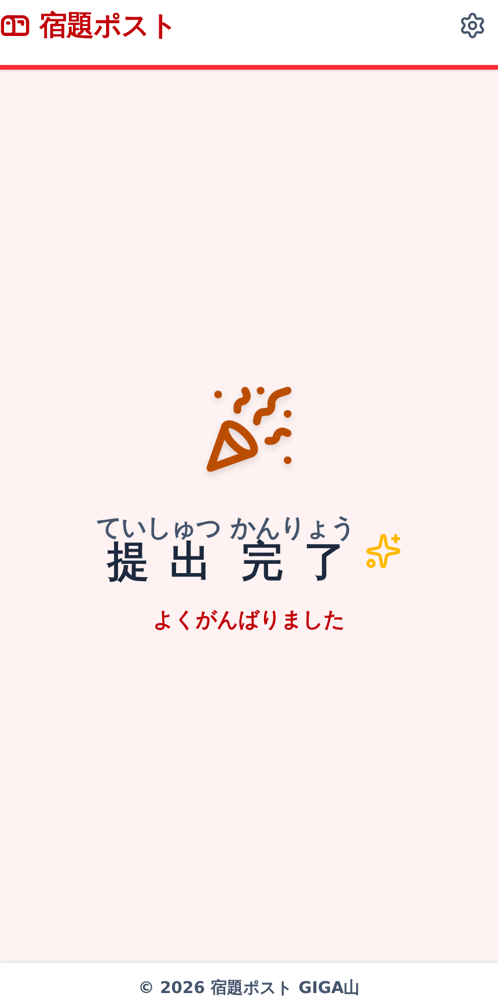

これで終わりです。だいたい十秒で終わる作りにしました。出すものが無い日や、忘れてしまった日は、何も選ばずに次へ進めます。その日はきもちの記録だけが残ります。忘れた子が受付に並べなくなるのは、いちばん避けたいことでした。

先生の側には、これが一覧になって届きます。

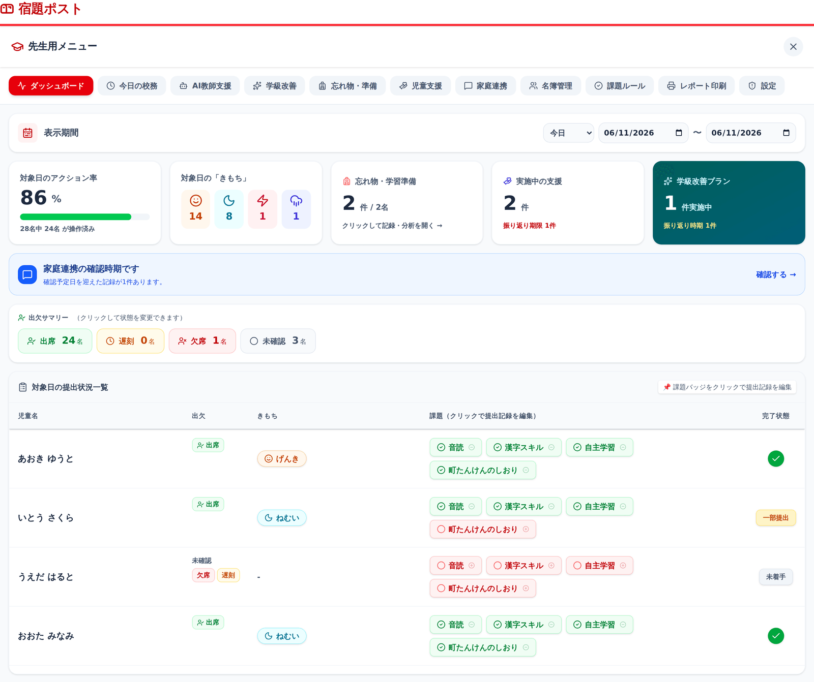

その日の提出、きもち、出欠が一枚にまとまります。表示する期間は今日、今週、今月、先月、期間指定から選べるので、朝は今日を見て、面談の前は先月を見る、という使い分けができます。

上の段には、その日どれだけ受付が進んだかと、クラス全体のきもちの内訳が出ます。この二つを並べたのは、提出率だけを見ていると気づけないことがあると思ったからです。全員が宿題を出した日に「かなしい」が三人いる、ということは起こります。

朝の受付は、どうしても抜けが出ます。保健室に寄っていた子、遅れてきた子、端末の前で友達と話しこんでしまった子。だから見るだけの画面にはしませんでした。

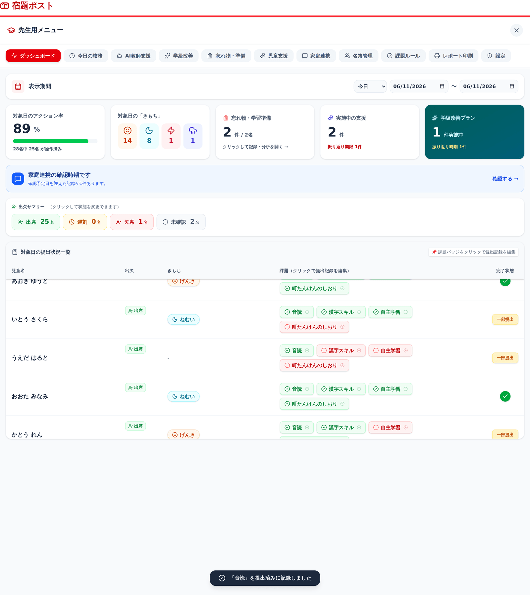

課題名のバッジを押すだけで、その場で提出済みにできます。もう一度押せば取り消しです。提出もきもちも記録がない子には、欠席と遅刻のボタンが出ます。あとから先生が入れれば、記録はその日のうちに埋まります。

それでも、朝いちばんに何を見ればいいのかは迷います。そこで、今日やることを一枚にまとめる画面を用意しました。

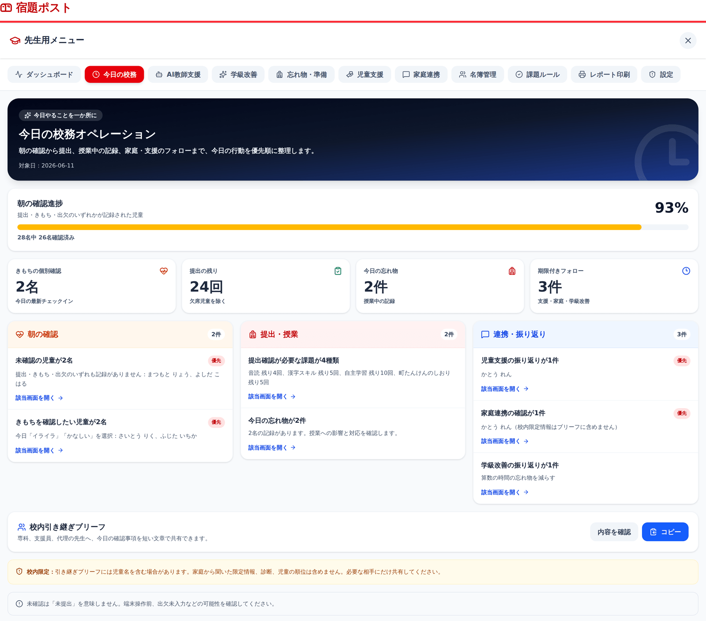

朝の未確認、きもちを確認したい子、提出の残り、今日の忘れ物、期限を迎えた振り返り。優先順に並び、それぞれ該当する画面へそのまま移動できます。ここだけ見れば足りるようにしたつもりです。

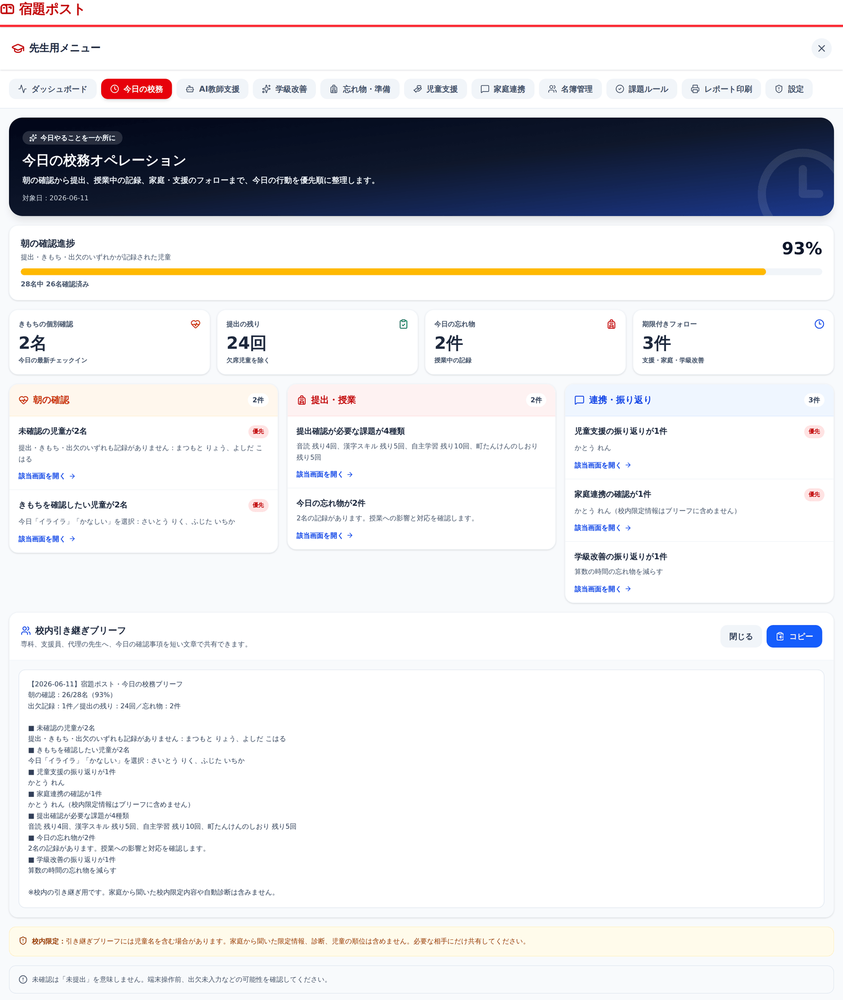

専科や支援員の先生に渡す引き継ぎの文章も、この画面から作れます。中身を確認してからコピーする形にしてあり、家庭から聞いた校内限定の内容は入りません。出張で教室を空ける日に、口頭で伝えきれないところを埋めるための機能です。

授業中に見つかることも記録できます。

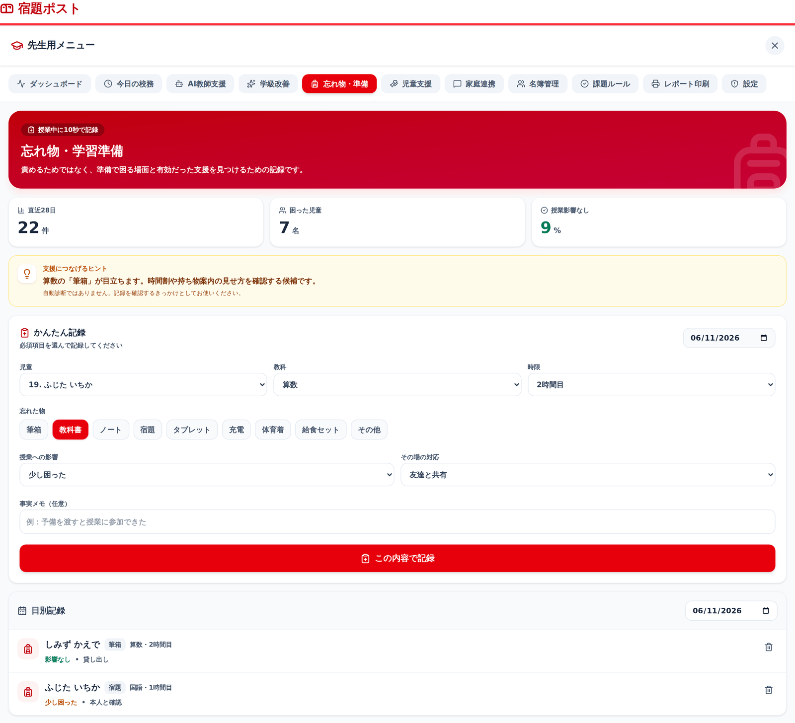

児童、教科、時限、忘れた物、授業への影響、その場の対応を、選ぶだけで記録します。忘れた物は筆箱や教科書など九つ、対応は貸し出しや友達と共有など六つを用意しました。授業を止めずに数タップで終わるようにするためです。この記録は子どもを評価するためのものではなく、時間割や持ち物案内を見直すためのものだと考えています。

## 🌙 出していない宿題を、未提出にしない

作っていていちばん気になったのが、提出率という数字の危うさでした。

行事があった日、テスト前で宿題を出さなかった日。そういう日まで「必要だった回数」に数えてしまうと、提出率は実態よりずっと低く出ます。その数字をもとに「最近がんばっていないね」と声をかけたら、子どもにとってはたまったものではありません。

そこで、アプリのほうから「この日は宿題を出していなかったのではありませんか」と提案する仕組みを入れました。

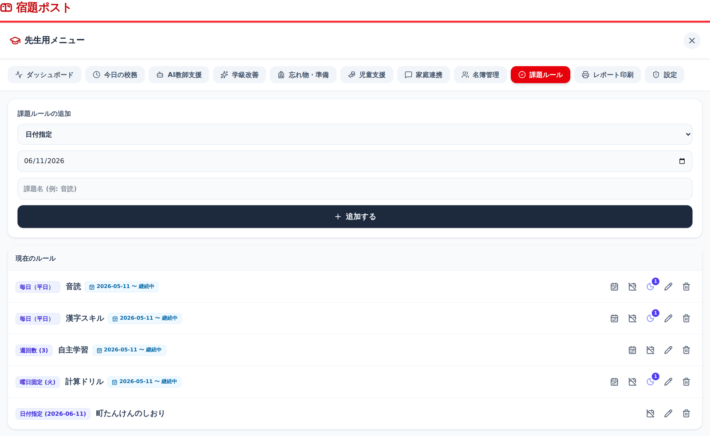

課題は毎日、曜日固定、週の回数指定、日付指定の四つの形で登録できます。それぞれに有効期間とおやすみ日を持たせてあります。

有効期間は、その課題を出しはじめた日と、やめた日を入れておくところです。四月から出していた課題を六月に登録したときは、開始日をさかのぼって直します。そうしないと、まだ課題を出していなかった時期まで未提出として数えられてしまいます。おやすみ日は、平日毎日の課題を今日だけ休みにしたいときに使います。運動会の前日など、宿題を出さないと決めた日を入れておくところです。

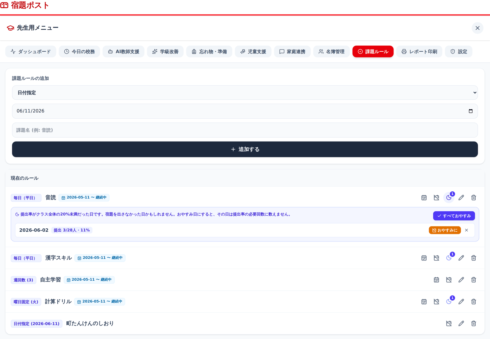

過去六十日をさかのぼり、その日の提出率がクラス全体の二十パーセントに満たなかった日を自動で洗い出します。画面の例では、六月二日の音読が二十八人中三人、十一パーセントでした。校外学習の日です。この日をおやすみ日にすれば、必要回数から外れます。一件ずつでも、まとめてでも採用できます。

母数は在籍している児童から、その日の欠席者を引いた人数です。遅刻は登校しているので母数に入れています。週の回数指定の課題は、日によって提出が偏るのがふつうの運用なので、提案は出しません。

数字を良く見せるための機能ではありません。実際には提出が必要でなかった日を、あとから不当な未提出にしないための機能です。記録が正しくない可能性を、記録する側が先に認めておく。この機能は、そのために付けました。提出率という数字を子どもに見せるなら、そこまでやってからにしたいと思っています。

## 🤝 気づいたことを、その子への一手までつなぐ

朝のきもちを記録しても、それが引き出しの中で眠っていては意味がありません。記録から次の一手までを、同じ画面の中でつなげたいと思いました。

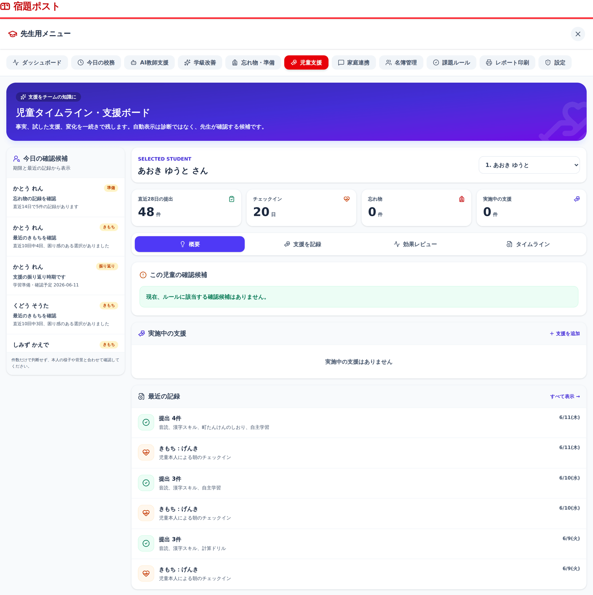

最近の記録と振り返りの期限から、今日確認したい子の候補が並びます。診断でも順位付けでもなく、先生が確認するきっかけを出すだけの表示です。件数だけで決めないでほしいという注意書きも、画面の中に入れました。

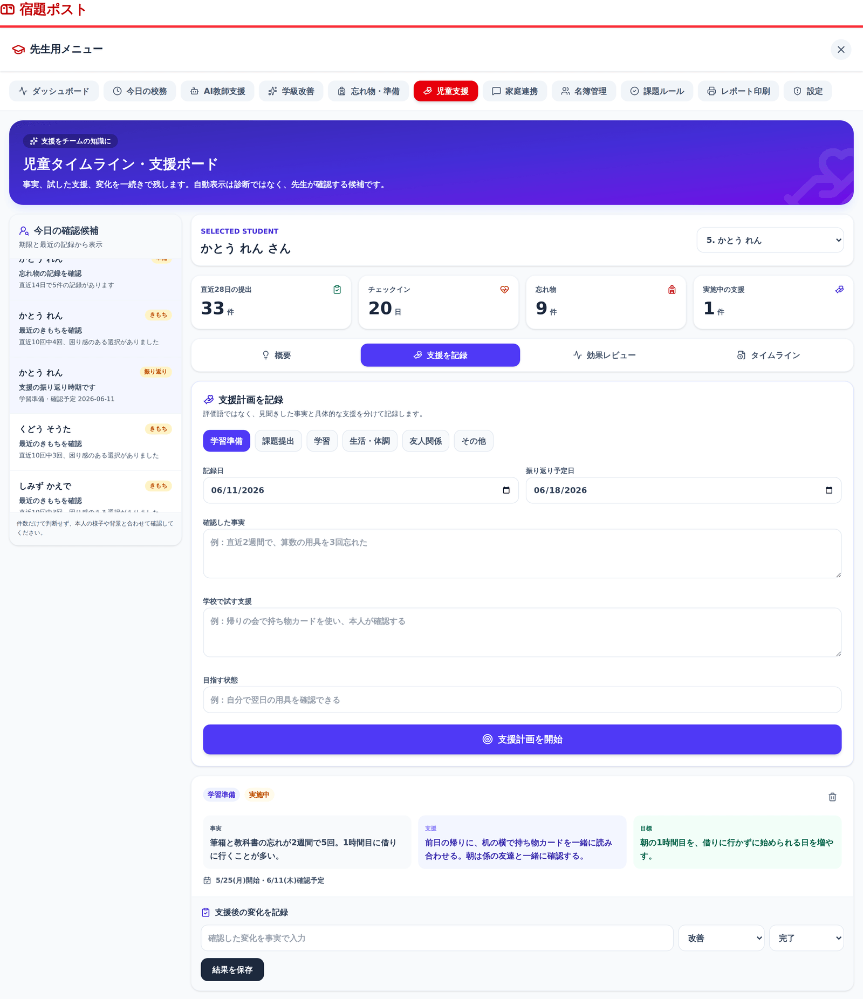

記録するときは、確認した事実、学校で試すこと、目指す状態、振り返りの予定日を分けて書きます。分けて書く形にしたのは、「気になる子」で終わらせないためです。何をしたのかが残っていれば、次の担任にも引き継げます。

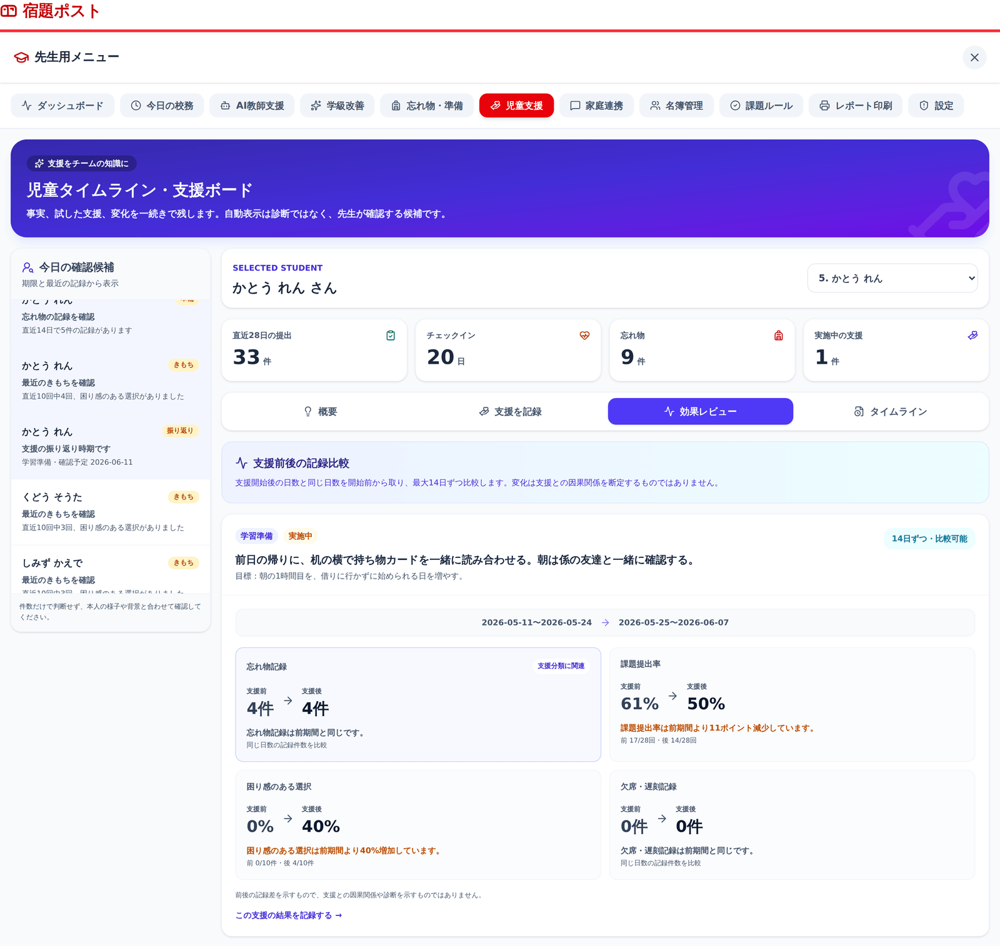

振り返りの日が来ると、支援を始める前と後を同じ日数で比べた表示が出ます。比べられるのは最大十四日ぶんで、七日に満たないときは判断を促さず、記録を続けてくださいと出るようにしました。画面の例では、忘れ物は変わらず、提出率はむしろ下がっています。都合の良い数字だけを見せない作りにしたつもりです。この数字は支援と結果の因果関係を示すものではない、という断り書きも消せないようにしてあります。

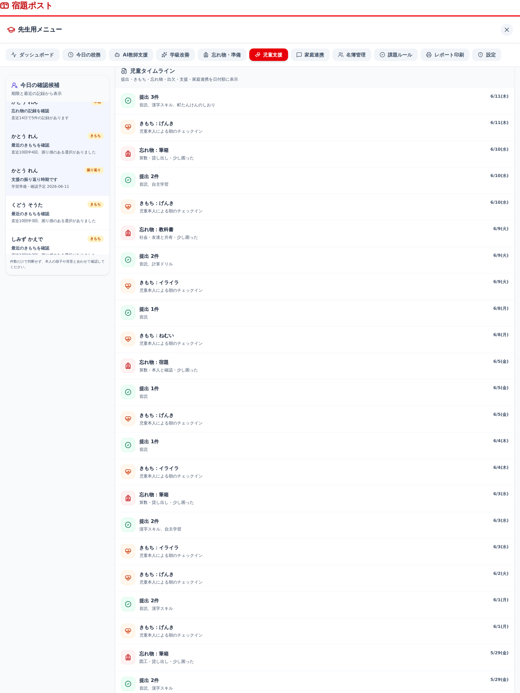

提出、きもち、出欠、忘れ物、支援、家庭との連携が、一人ぶんの時系列で並びます。別々の帳簿を突き合わせなくても、この子の最近が数十秒で見わたせます。

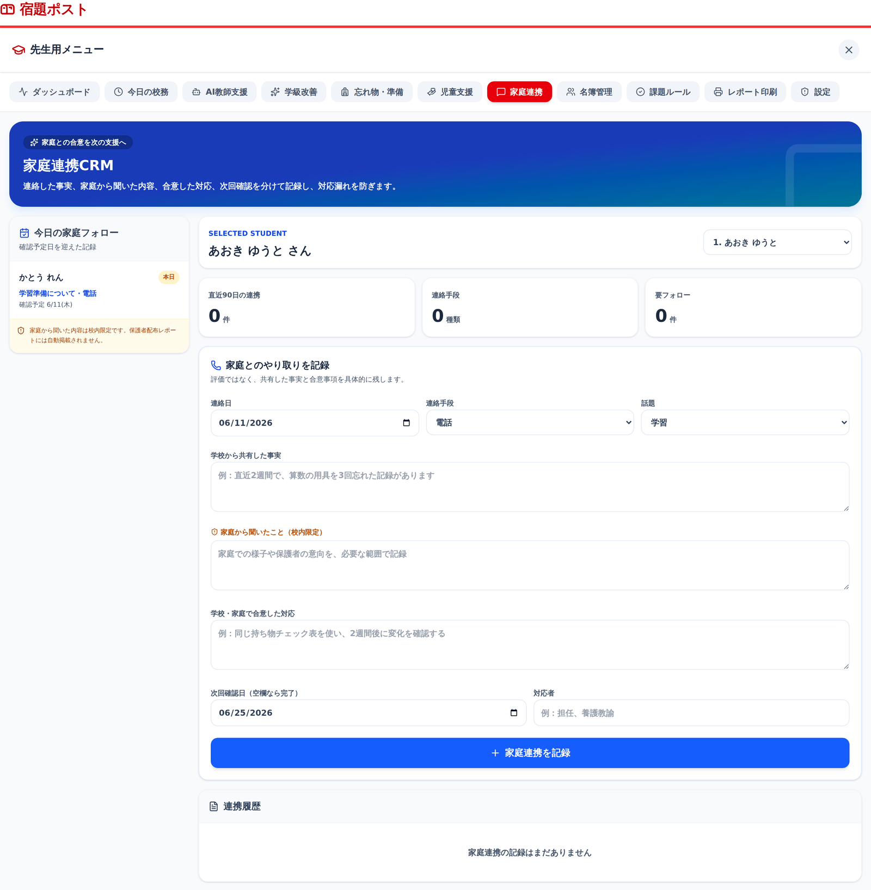

家庭とのやり取りも、学校から共有した事実、家庭から聞いたこと、合意した対応、次回の確認日に分けて残します。家庭から聞いたことは校内限定として扱い、保護者へ渡す資料にも子どものタイムラインにも出しません。ここは分けておかないと、いつか事故になると思いました。

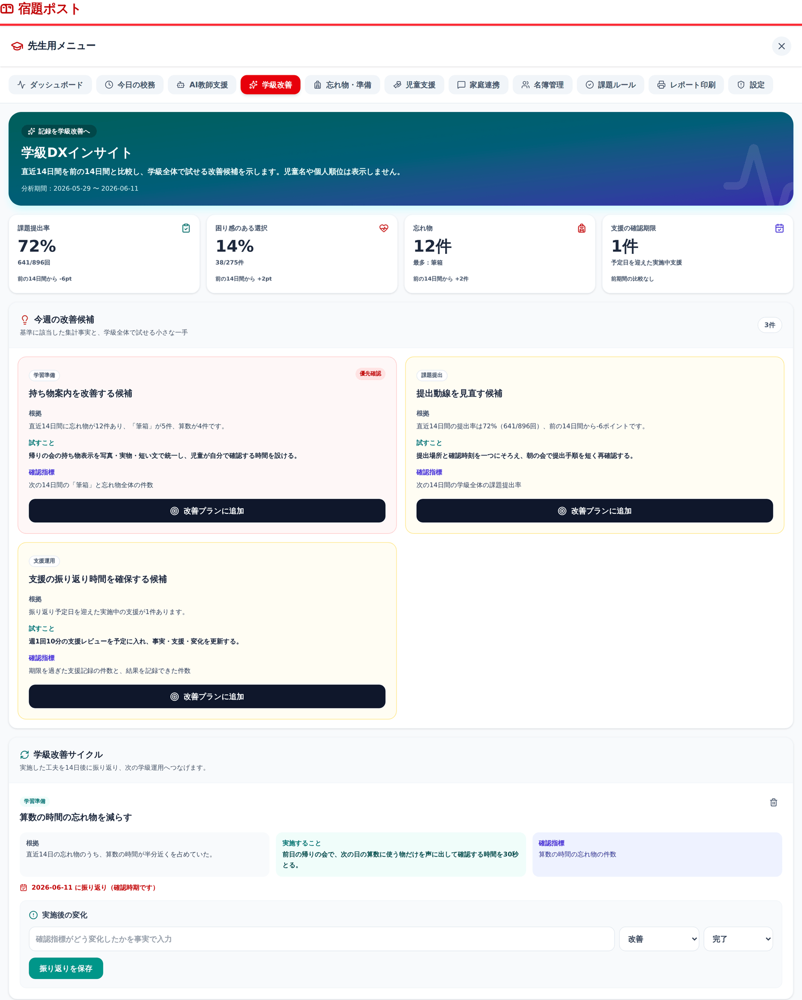

学級全体については、直近十四日を前の十四日と比べて、変化と試せる一手を出します。子どもの名前も個人の順位も出しません。出てきた候補は、期限付きの改善プランに変えて残せます。分析して終わりではなく、小さな改善を積み上げるための画面です。

## ✨ 導入のメリット

三つのいいことが期待できます。

一つ目は、朝の十分がまるごと手もとに戻ってくることです。宿題の確認は子どもが自分で終わらせ、先生はその結果を一覧で受けとります。名簿に丸を付けながら教室を歩き回る必要がなくなるので、そのぶんの時間を、朝いちばんに気になった子と話すことに使えます。丸付けをしながらでは、こちらから声をかけにいくのは難しいものです。手が空いていることそのものが、教室では意味を持つのだと思います。

二つ目は、気づきが記録として残ることです。「今日は元気がなかった気がする」という感覚は、その日のうちに消えてしまいます。四つのボタンで残しておけば、二週間後に振り返ったときに「そういえば先週も同じ選択だった」と気づけます。子どもが自分で選んだ記録なので、先生の主観も混ざりません。学級を持ち上がらない年や、途中で担任が替わる年にも、この記録は残ります。引き継ぎのときに「気になる子です」としか言えなかったところを、いつ何があって何を試したかまで渡せるようになります。

三つ目は、面談や引き継ぎの準備が短くなることです。学期末レポート、保護者面談サマリー、校内支援ケース資料の三つを、A4一枚で出せるようにしました。

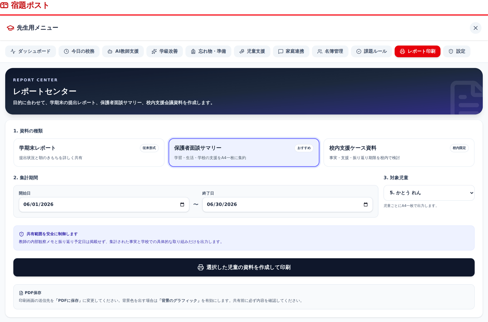

期間と対象の子を選ぶだけです。

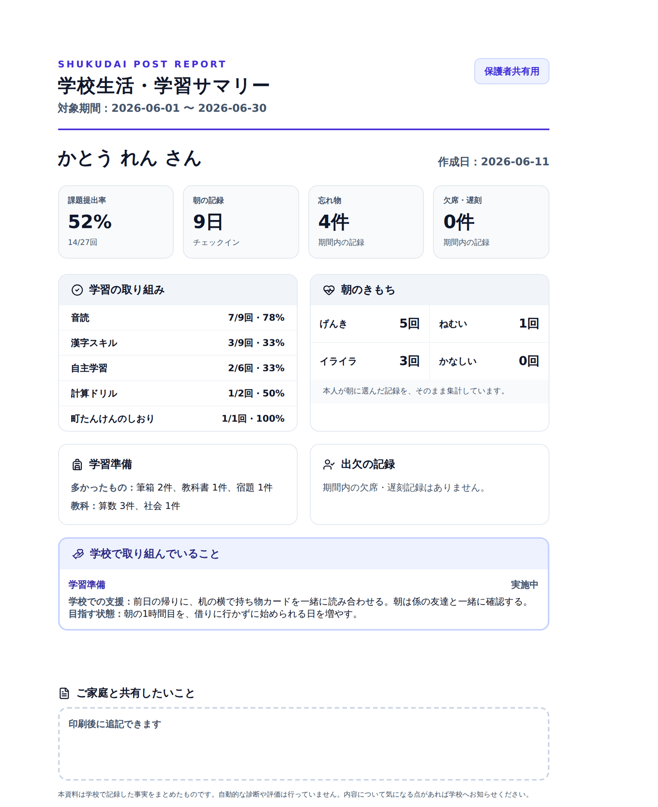

保護者へ渡すものには、集計と学校での取り組みだけを載せます。先生の内部の観察メモや振り返りの予定日は自動的に外れます。校内で検討する資料には取扱注意を明示したうえで、事実から次回の確認までを一続きで載せます。渡す相手ごとに何を出さないかを、アプリの側で決めている形です。

前の晩に手書きで作っていた面談資料が、印刷ボタンひとつになれば、その時間はほかのことに使えると思います。

## 🛠️ 【管理者向け】導入手順

情報担当の先生に確認されることを、先に書いておきます。

はじめに、データがどこにあるかです。名簿も記録も、アプリを開いている端末のブラウザの中だけに保存されます。開発者のサーバーには送られません。名簿に入れるのは名前と出席番号だけで、住所も生年月日も扱いません。外に出るのは、Googleドライブ同期を先生が自分で有効にしたときと、生成AIの機能を設定したうえで送信に同意したときだけです。どちらも既定では止まっています。

校内のフィルタリングで許可が要るのは、多くても三か所です。文字の書体を読むために fonts.googleapis.com と fonts.gstatic.com を使いますが、ここは塞がれていても、端末に入っている書体で表示されるだけで動作には影響しません。複数の端末でデータを共有したいときだけ、accounts.google.com と www.googleapis.com が必要になります。生成AIの機能を使う場合は、学校または設置者が用意した窓口のアドレスを許可します。この三つ目は学校ごとに違うので、置いた方に聞いてください。何も使わない場合は、最初の二つが塞がれていても困りません。

先生用メニューは、右上の歯車から入ります。最初のPINコードはadminです。

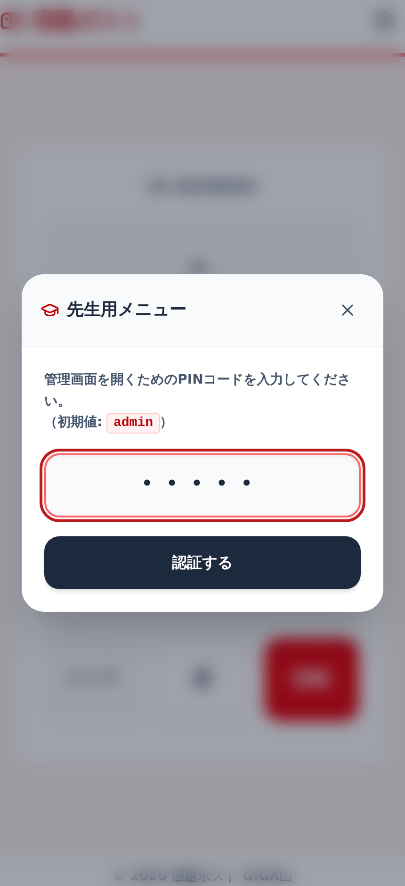

名簿は、名前を改行で貼り付けるだけで一括登録できます。出席番号は空いている番号から自動で割り当てられます。

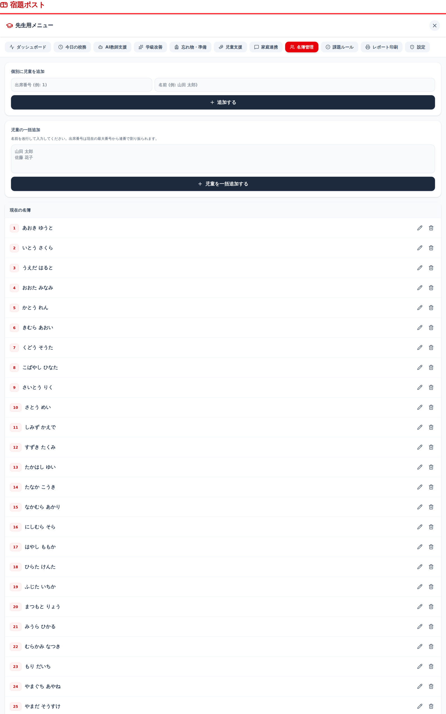

導入は、この順で進めてください。

1. 上のURLを教室の端末で開く。ヘッダー右上の「ホームに いれる」を押すと、アイコンから開けるようになります。iPadの場合はSafariの共有ボタンから「ホーム画面に追加」を使ってください
2. 右上の歯車から先生用メニューに入る。最初のPINコードはadminです
3. 設定タブで、PINコードを必ず変える。adminのままだと子どもが入れてしまいます。新しいPINは英数字六文字以上です。先生用メニューは十分間操作がないと、自動で受付画面に戻ります
4. 名簿管理タブで、クラスの名前を改行で貼り付ける
5. 見本として入っている「さとう 花子」と「すずき 太郎」を削除する。課題ルールにも見本が二つ入っているので、こちらも実際のルールに置きかえてください
6. 課題ルールタブで、クラスのルールを登録する。ここまでで準備は終わりです

バックアップについても、先に決めておいてください。

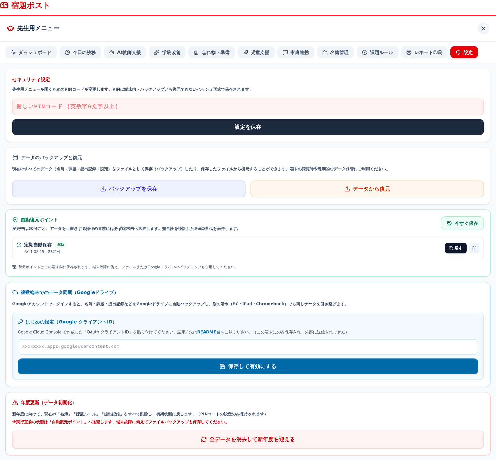

記録はその端末の中にあるので、ブラウザの履歴を消すと一緒に消えます。端末の中には三十分ごとと、データを上書きする操作の直前に、自動の復元ポイントが最新五世代まで残ります。ただしこれは端末が壊れると一緒に失われます。設定タブから月に一度はファイルとして保存しておくか、Googleドライブ同期を併用してください。

生成AIの機能は任意です。使わなくても、子どもの入力と日々の記録はすべて使えます。

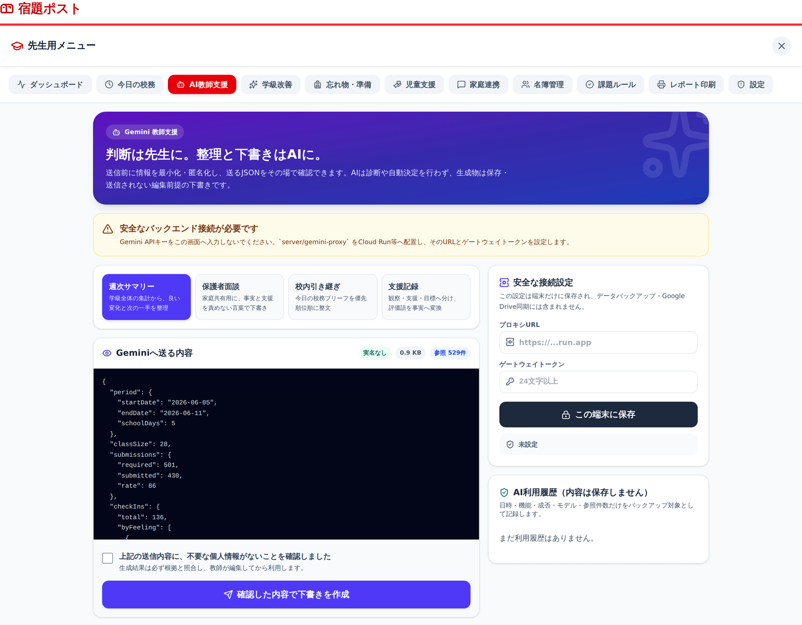

使う場合も、APIキーをこのアプリに入れることはできない作りにしてあります。学校または設置者が管理する窓口を別に置き、鍵はそちらに預けます。送る内容は画面にそのまま出て、先生が確認してチェックを入れるまで送信されません。子どもの名前と連絡先は仮名に置きかえてから送り、実名が残っていれば送信を止めます。出てくるのは下書きだけで、診断も順位付けも自動送信もしません。使う前に、学校や自治体の生成AIの決まりと、保護者への説明を必ず確認してください。

アプリが新しくなったときは、画面の下に案内が出ます。押すまで切りかわりません。朝の受付中に切りかわって、打ちかけの入力が消えるのを防ぐためです。休み時間か放課後に押してください。

## 📖 【利用者向け】使い方のガイド

子どもたちに伝えるのは、この三つだけです。

1. 教室の端末の前に立ち、自分の出席番号を打ってOKを押す
2. 今日出したものを選んで、つぎへを押す。出すものが無い日は、何も選ばずにつぎへを押す
3. 今のきもちを四つから選ぶ

先生の毎日は、この四つです。

1. 朝の会のあと、先生用メニューの「今日の校務」を開く
2. 未確認の子がいたら、ダッシュボードで欠席か遅刻を記録するか、提出のバッジを押して埋める
3. 授業中に忘れ物があったら、その場で「忘れ物・準備」に選ぶだけの記録を残す
4. 期限を迎えた振り返りが出ていたら、放課後に開いて結果を書く

慣れるまでは、一つ目と二つ目だけで十分だと思います。三つ目と四つ目は、続けられそうだと感じてから足してください。

## 📝 まとめ

このアプリで減らしたかったのは、作業そのものよりも「確認に追われている感じ」でした。

朝の十分間に名簿とにらめっこしていると、目の前を通り過ぎていく子の表情が見えません。宿題を出したかどうかは、子どもが自分で入力できることです。だとしたら、その十分は先生でなければできないことに使うほうがいいはずです。ICTで効率化すること自体が目的ではなくて、効率化した先に、子どもと向き合う時間が増えることのほうが大事だと思っています。

機能はずいぶん増えましたが、全部を使ってほしいとは思っていません。受付とダッシュボードだけでも、朝の形は変わります。忘れ物の記録も、支援の振り返りも、家庭との連携も、必要になったときに開けばいい引き出しとして置いてあるだけです。学校のICTは、増えた機能のぶんだけ先生の仕事が増えることがよくあります。そうならないように、使わない機能は目に入らないところで静かにしていてほしいと考えて並べました。

まずは自分の学級で、一週間だけ試してみるのがいいと思います。名簿を貼り付けて、課題を二つ登録すれば、その日の朝から使えます。合わなければ、それも分かったことの一つです。うまくいかなかったところは、教えていただけるとありがたいです。

一歩踏み出そうとする先生を、私はいつでも全力で応援しています。
